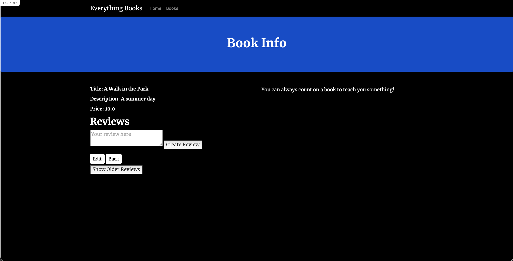

# How To Add Bootstrap to a Ruby on Rails Application

When developing a application, you may be interested in adding styles to your project to facilitate user engagement. One way to do this is by adding [Bootstrap](https://getbootstrap.com/), an HTML, CSS, and JavaScript framework designed to simplify the process of making web projects responsive and mobile ready. By implementing Bootstrap in a Rails project, you can integrate its layout conventions and components into your application to make user interactions with your site more engaging.

In this section, you will add Bootstrap to `bnb-library` that uses the [webpack](https://webpack.js.org/) bundler to serve its JavaScript and CSS assets. The goal will be to create a visually appealing site that users can interact with to share information about books:

## Step 1 — Adding a Main Landing Page and Controller
The current application sets the root view to the main books information page, the `index` view for the `books` controller. While this works to get users to the main application, it may be less desirable if we decide to develop the application in the future and add other capabilities and features. We can reorganize the application to have the root view set to a `home` controller, which will include an `index` view. From there, we can link out to other parts of the application.

To create the `home` controller, you can use the [rails generate](https://guides.rubyonrails.org/command_line.html#rails-generate) command with the controller generator. In this case, we will specify that we want an
`index` view for our main landing page:
```
dip rails generate controller home index
```
With the controller created, you'll need to modify the root view in the project's `config/routes.rb` file — the file that specifies the application's route declarations — since the root view is currently set to the books `index` view.

Open the file `config/routes.rb` and replace the root declaration with `'home#index'`:

<figure><strong><code>config/routes.rb</code></strong></figure>

```rb
root 'home#index'
```
This will set the `home` controller's `index` view as the root of the application, making it possible to branch off to other parts of the application from there.

Save and close the file when you are finished editing.

With these changes in place, you are ready to move on to adding Bootstrap to the application.

## Step 2 — Installing Bootstrap and Adding Custom Styles
In this step, you will add Bootstrap to your project, along with the tool libraries that it requires to function properly. This will involve importing libraries and plugins into the application's webpack entry point and environment files. It will also involve creating a custom style sheet in your application's `app/javascript` directory, the directory where the project's JavaScript assets live.

First, use `yarn` to install Bootstrap and its required dependencies:
```
dip yarn add bootstrap jquery @popperjs/core
```
Many of Bootstrap's components require [JQuery](https://jquery.com/) and [Popper.js](https://popper.js.org/), along with Bootstrap's own custom plugins, so this command will ensure that you have the libraries you need.

Next, open your main webpack configuration file, `config/webpack/environment.js` with VSCode:
```rb
config/webpack/environment.js
```
Inside the file, add the webpack library, along with a [ProvidePlugin](https://webpack.js.org/plugins/provide-plugin/) that tells Bootstrap how to interpret JQuery and Popper variables.

Add the following code to the file:

<figure><strong><code>config/webpack/environment.js</code></strong></figure>

```js
const { environment } = require("@rails/webpacker")
const webpack = require("webpack")

environment.plugins.prepend("Provide",
  new webpack.ProvidePlugin({
    $: "jquery/src/jquery",
    jQuery: "jquery/src/jquery",
    Popper: "@popperjs/core"
  })
)

module.exports = environment

```
The `ProvidePlugin` helps us avoid the multiple `import` or `require` statements we would normally use when working with JQuery or Popper modules. With this plugin in place, webpack will automatically load the correct modules and point the named variables to each module's loaded exports.

Save and close the file when you are finished editing.

Next, open your main webpack entry point file, `app/javascript/packs/application.js`:
```rb
app/javascript/packs/application.js
```
Inside the file, add the following `import` statements to import Bootstrap and the custom `scss` styles file that you will create next:

<figure><strong><code>app/javascript/packs/application.js</code></strong></figure>

```js
import Rails from "@rails/ujs"
import Turbolinks from "turbolinks"
import * as ActiveStorage from "@rails/activestorage"
import "channels"

Rails.start()
Turbolinks.start()
ActiveStorage.start()

import "controllers"
import "bootstrap"
import "../stylesheets/application"
```
Save and close the file when you are finished editing.

Next, create a `stylesheets` directory in VSCode for your application style sheet:
```rb
app/javascript/stylesheets
```
Create and open the custom styles file:
```rb
app/javascript/stylesheets/application.scss
```
This is an scss file, which uses [Sass](https://sass-lang.com/) instead of [CSS](https://en.wikipedia.org/wiki/Cascading_Style_Sheets). Sass, or Syntactically Awesome Style Sheets, is a CSS extension language that lets developers integrate programming logic and conventions like shared variables into styling rules.

In the file, add the following statements to import the custom Bootstrap `scss` styles and Google fonts for the project:

<figure><strong><code>app/javascript/stylesheets/application.scss</code></strong></figure>

```scss
@import "~bootstrap/scss/bootstrap";
@import url('https://fonts.googleapis.com/css?family=Merriweather:400,700');
```
Next, add the following custom variable definitions and styles for the application:

<figure><strong><code>app/javascript/stylesheets/application.scss</code></strong></figure>

```scss
$white: white; 
$black: black;

.navbar {
  margin-bottom: 0;
  background: $black;
}

body {
  background: $black;
  color: $white;
  font-family: 'Merriweather', sans-serif;
} 

h1, h2 {
  font-weight: bold;
} 

p {
  background: $black;
  color: $white;
  font-family: 'Merriweather', sans-serif;
  font-weight: bold;
  font-size: 16px;
  color: $white;
}

a:visited {
  color: $black;
}

.jumbotron {
  background: #0048CD; 
  color: $white; 
  text-align: center; 
  p {
    color: $white;
    font-size: 26px;
  } 
}

.link {
  color: $white;
}

.btn-primary {
  color: $white;
  border-color: $white;
  margin-bottom: 5px;
}

.btn-sm {
  background-color: $white;
  display: inline-block;
}

img, video, audio {
  margin-top: 20px;
  max-width: 80%;
}

caption {
  float: left;
  clear: both;
}
```
Save and close the file when you are finished editing.

You have added Bootstrap to your project, along with some custom styles! Now you can move on to integrating Bootstrap layout conventions and components into your application files.

## Step 3 — Modifying the Application Layout
Our first step in integrating Bootstrap conventions and components into the project will be adding them to the main application layout file. This file sets the elements that will be included with each rendered view template for the application. In this file, we'll make sure our webpack entry point is defined, while also adding references to a shared navigation headers [partial](https://guides.rubyonrails.org/layouts_and_rendering.html#using-partials) and some logic that will allow us to render a layout for the views associated with the library application.

First, open `app/views/layouts/application.html.haml`, your application's main layout file:

Currently, the file looks like this:

<figure><strong><code>app/views/layouts/application.html.haml</code></strong></figure>

```haml
!!!
%html
  %head
    %meta{:content => "text/html; charset=UTF-8", "http-equiv" => "Content-Type"}/
    %title BnbLibrary
    %meta{:content => "width=device-width,initial-scale=1", :name => "viewport"}/
    = csrf_meta_tags
    = csp_meta_tag
    = stylesheet_link_tag 'application', media: 'all', 'data-turbolinks-track': 'reload'
    = javascript_pack_tag 'application', 'data-turbolinks-track': 'reload'
  %body
    = yield
```
The code renders things like [cross-site request forgery protection parameters and tokens](https://api.rubyonrails.org/classes/ActionView/Helpers/CsrfHelper.html) for dynamic forms, a [csp-nonce](https://api.rubyonrails.org/v5.2.3/classes/ActionView/Helpers/CspHelper.html) for per-session nonces that allows in-line script tags, and the application's style sheets and javascript assets. Note that rather than having a `javascript_link_tag`, our code includes a `javascript_pack_tag`, which tells Rails to load our main webpack entry point at `app/javascript/packs/application.js`.

In the `<body>` of the page, a `yield` statement tells Rails to insert the content from a view. In this case, because our application root formerly mapped to the `index` book view, this would have inserted the content from that view. Now, however, because we have changed the root view, this will insert content from the `home` controller's `index` view.

This raises a couple of questions: Do we want the home view for the application to be the same as what users see when they view the book application? And if we want these views to be somewhat different, how do we implement that?

The first step will be deciding what should be replicated across all application views. We can leave everything included under the `<head>` in place, since it is primarily tags and metadata that we want to be present on all application pages. Within this section, however, we can also add a few things that will customize all of our application views.
           
First, replace the existing `title` code with code that will render the application title in a more dynamic way:

<figure><strong><code>app/views/layouts/application.html.haml</code></strong></figure>

```haml
!!!
%html
  %head
    %meta{:content => "text/html; charset=UTF-8", "http-equiv" => "Content-Type"}/
    %title= content_for?(:title) ? yield(:title) : "About Books"
    %meta{:content => "width=device-width,initial-scale=1", :name => "viewport"}/
```
Add a `<meta>` tag to include a description of the site:

<figure><strong><code>app/views/layouts/application.html.haml</code></strong></figure>

```haml
!!!
%html
  %head
    %meta{:content => "text/html; charset=UTF-8", "http-equiv" => "Content-Type"}/
    %title= content_for?(:title) ? yield(:title) : "About Books"
    %meta{:content => content_for?(:description) ? yield(:description) : "About Books", :name => "description"}
    %meta{:content => "width=device-width,initial-scale=1", :name => "viewport"}/
```
With this code in place, you can add a navigation partial to the layout. Ideally, each of our application's pages should include a [navbar](https://getbootstrap.com/docs/4.0/components/navbar/) component at the top of the page, so that users can easily navigate from one part of the site to another.

Under the `<body>` tag, add a `<header>` tag and the following render statement:

<figure><strong><code>app/views/layouts/application.html.haml</code></strong></figure>

```haml
%body
  %header= render 'layouts/navigation'
  = yield
```
This `<header>` tag allows you to organize your page content, separating the navbar from the main page contents.

Finally, you can add a `<main>` element tag and some logic to control which view, and thus which layout, the application will render. This code uses the [content_for method](https://api.rubyonrails.org/classes/ActionView/Helpers/CaptureHelper.html#method-i-content_for) to reference a content identifier that we will associate with our books layout in the next step.
   
Replace the existing `yield` statement with the following content:

<figure><strong><code>app/views/layouts/application.html.haml</code></strong></figure>

```haml
%body
  %header= render 'layouts/navigation'
  %main{:role => "main"}= content_for?(:content) ? yield(:content) : yield
```
Now, if the `:content` block is set, the application will yield the associated layout. Otherwise, thanks to the ternary operator, it will do an implicit yield of the view associated with the `home` controller.

Once you have made these changes, save and close the file.

With the application-wide layout set, you can move on to creating the shared navbar partial and the books layout for your book views.

## Step 4 — Creating the Shared Partial and Specific Layouts
In addition to the changes you made to the application layout in the previous Step, you will want to create the shared navbar partial, the books layout that you referenced in `app/views/layouts/application.html`.haml, and a view for the application landing page. You can also add Bootstrap styles to your application's current `link_to` elements in order to take advantage of built-in Bootstrap styles.

First, create and open a file for the shared navbar partial:
```rb
app/views/layouts/_navigation.html.haml
```
Add the following code to the file to create the navbar:

<figure><strong><code>app/views/layouts/_navigation.html.haml</code></strong></figure>

```haml
%nav.navbar.navbar-dark.navbar-static-top.navbar-expand-md
  .container
    %button.navbar-toggler.collapsed{"aria-expanded" => "false", "data-target" => "#bs-example-navbar-collapse-1", "data-toggle" => "collapse", :type => "button"}
      %span.sr-only
        Toggle navigation
    = link_to "Everything Books", root_path, class: 'navbar-brand'
    #bs-example-navbar-collapse-1.collapse.navbar-collapse
      %ul.nav.navbar-nav.mr-auto
        %li.nav-item= link_to 'Home', home_index_path, class: 'nav-link'
        %li.nav-item= link_to 'Books', books_path, class: 'nav-link'
```
This navbar creates a link for the application root using the [link_to](https://api.rubyonrails.org/v5.2.3/classes/ActionView/Helpers/UrlHelper.html#method-i-link_to) method, which maps to the application root path. The navbar also includes two additional links: one to the `Home` path, which maps to the `home` controller's `index` view, and another to the book application path, which maps to the `book` `index` view.

Save and close the file when you are finished editing.

Next, create and open a file in the `layouts` directory for the books layout:
```rb
app/views/layouts/books.html.haml
```
Before adding layout features, we will need to ensure that the content of the layout is set as the `:content` block that we reference in the main application layout. Add the following lines to the file to create the block:

<figure><strong><code>app/views/layouts/books.html.haml</code></strong></figure>

```haml
- content_for :content do
```
The code we're about to write in this block will be rendered inside the `:content` block in the `app/views/layouts/application.html.haml` file whenever a books view is requested by a controller.

Next, inside the block itself, add the following code to create a [jumbotron](https://getbootstrap.com/docs/4.3/components/jumbotron/) component and two [containers](https://getbootstrap.com/docs/4.3/layout/overview/#containers):

<figure><strong><code>app/views/layouts/books.html.haml</code></strong></figure>

```haml
.jumbotron.text-center
  %h1 Book Info
.container
  .row
    .col-lg-6
      %p
        = yield
    .col-lg-6
      %p
        .caption
          You can always count on a book to be friendly and welcoming!
```
The first container includes a `yield` statement that will insert the content from the `book` controller's views, while the second includes a reminder that certain books are always friendly and welcoming.

Finally, at the bottom of the file, add the following `render` statement to render the application layout:

<figure><strong><code>app/views/layouts/books.html.haml</code></strong></figure>

```haml
      .col-lg-6
        %p
          .caption
            You can always count on a book to be friendly and welcoming!
= render template: "layouts/application"
```
This books layout will provide the content for the named `:content` block in the main application layout; it will then render the application layout itself to ensure that our rendered application pages have everything we want at the application-wide level.

Save and close the file when you are finished editing.

We now have our partials and layouts in place, but we haven't yet created the view that users will see when they navigate to the application home page, the `home` controller's `index` view.
   
Open that file now:
```rb
app/views/home/index.html.haml
```
The structure of this view will match the layout we defined for book views, with a main jumbotron component and two containers. Replace the boilerplate code in the file with the following:

<figure><strong><code>app/views/home/index.html.haml</code></strong></figure>

```haml
.jumbotron
  .container
    %h1 Looking for a new Book?
    %h3 Ready to get reading?
    %br
    = link_to 'Get Book Info', books_path, class: "btn btn-primary btn-lg"
.container
  .row
    .col-lg-6
      %h3 Not all books are alike
      %p
        There are many different genres, from fiction to autobiographies. 
        Some books are serious while others are light hearted and fun. 
    .col-lg-6
      %h3 Books are important
      %p
        Books allow readers to travel without using their feet.
        Books give wings to our imagination.
```
Now, when landing on the home page of the application, users will have a clear way to navigate to the book section of the application, by clicking on the *Get Book Info* button. This button points to the `book_path` — the helper that maps to the routes associated with the `books` controller.

Save and close the file when you are finished editing.

Our last task will be to transform some of the `link_to` methods in our application into buttons that we can style using Bootstrap. We will also add a way to navigate back to the home page from the books `index` view.

Open the books `index` view to start:
```rb
app/views/books/index.html.haml
```
At the bottom of the file, locate the `link_to` method that directs to the `new` book view:

<figure><strong><code>app/views/books/index.html.haml</code></strong></figure>

```haml
= link_to 'New Book', new_book_path
```
Modify the code to turn this link into a button that uses Bootstrap's `btn btn-primary btn-sm"` class:

<figure><strong><code>app/views/books/index.html.haml</code></strong></figure>

```haml
= link_to 'New Book', new_book_path, class: 'btn btn-primary btn-sm'
```
Next, add a link to the application home page:

<figure><strong><code>app/views/books/index.html.haml</code></strong></figure>

```haml
= link_to 'New Book', new_book_path, class: 'btn btn-primary btn-sm'
= link_to 'Home', home_index_path, class: 'btn btn-primary btn-sm'
```
Save and close the file when you are finished editing. 

Next, open the `new` view:
```rb
app/views/books/new.html.haml
```
Add the button styles to the `link_to` method at the bottom of the file:

<figure><strong><code>app/views/books/new.html.haml</code></strong></figure>

```haml
= link_to 'Back', books_path, class: 'btn btn-primary btn-sm'
```
Save and close the file. Open the `edit` view:
```rb
app/views/books/new.html.haml
```
Currently, the `link_to` methods are arranged like this:

<figure><strong><code>app/views/books/new.html.haml</code></strong></figure>

```haml
%h1 Editing Book
= render 'form', book: @book
= link_to 'Show', @book
|
= link_to 'Back', books_path
```
Change their arrangement on the page and add the button styles, so that the code looks like this:

<figure><strong><code>app/views/books/new.html.haml</code></strong></figure>

```haml
= link_to 'Show', @book, class: 'btn btn-primary btn-sm'
= link_to 'Back', books_path, class: 'btn btn-primary btn-sm'
```
Save and close the file. 

Finally, open the `show` view:
```rb
app/views/books/show.html.haml
```
Find the following `link_to` methods:

<figure><strong><code>app/views/books/show.html.haml</code></strong></figure>

```haml
= link_to 'Edit', edit_book_path(@book)
|
= link_to 'Back', books_path
```
Change them to look like this:

<figure><strong><code>app/views/books/show.html.haml</code></strong></figure>

```haml
= link_to 'Edit', edit_book_path(@book), class: 'btn btn-primary btn-sm'
= link_to 'Back', books_path, class: 'btn btn-primary btn-sm'
```
Save and close the file.

You are now ready to test the application.

Start your server and navigate to `localhost:3000`.
```
dip up
```
You will see the following landing page:

Click on *Get Book Info*. You will see the following page:

You can now edit your book, or add a description and reviews. You can also add new books to the conversation.

As you navigate to other book views, you will see that the book layout is always included:

You now have Bootstrap integrated into your Rails application. From here, you can move forward by adding new styles and components to your application to make it more appealing to users!
