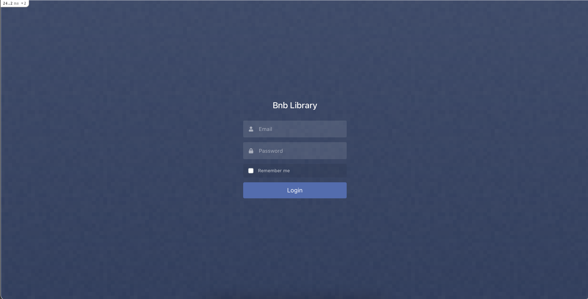

# Adding User Authentication

In [Step 6](./functionality.md) - Adding Authentication we added the [http_basic_authenticate_with](https://api.rubyonrails.org/classes/ActionController/HttpAuthentication/Basic.html) method, which allowed us to create a username and password combination to authenticate users. This is not a practical use case when we are going to have more than one user, each with a unique email and password, and different levels of permissions (eg. admin vs user). To handle all of these cases we will be introducing the [Devise](https://github.com/heartcombo/devise) Gem. 

## Step 1 - Add the gem
Open your Gemfile. To start using Devise, first add it to your Gemfile: 
```rb
# bnb-library/Gemfile
---------------------

gem 'font-awesome-rails', '~>4.x'
gem 'trestle'
gem 'devise'
```
Bundle your Gemfile: 
```
dip bundle install
```
You can expect to see an output similar to: 
```rb
# output
--------

Fetching gem metadata from https://rubygems.org/............
Fetching gem metadata from https://rubygems.org/.
Resolving dependencies...
.. .
Using actionmailer 6.1.3
Using actiontext 6.1.3
Using public_suffix 4.0.6
Using addressable 2.7.0
# Fetching bcrypt 3.1.16
# Installing bcrypt 3.1.16 with native extensions
Using bindex 0.8.1
.. .
Using capybara 3.35.3
Using childprocess 3.0.0
# Fetching orm_adapter 0.5.0
# Installing orm_adapter 0.5.0
Using method_source 1.0.0
Using thor 1.1.0
Using railties 6.1.3
# Fetching responders 3.0.1
# Installing responders 3.0.1
# Fetching warden 1.2.9
# Installing warden 1.2.9
# Fetching devise 4.7.3
# Installing devise 4.7.3
Using erubis 2.7.0
Using ffi 1.15.0
.. .
Bundle complete! 21 Gemfile dependencies, 93 gems now installed.
Use `bundle info [gemname]` to see where a bundled gem is installed.
```

## Step 2 - Generate Resource
Now we will take advantage of the install generator baked into Devise to create the initial configuration file and customization hooks:
```
dip rails generate devise:install
```
```
# output
--------

Starting bnb-library_postgres_1 ... done
Running via Spring preloader in process 19
      create  config/initializers/devise.rb
      create  config/locales/devise.en.yml
==============================================

Depending on your application's configuration some manual setup may be required:

  1. Ensure you have defined default url options in your environments files. Here is an example of default_url_options appropriate for a development environment in config/environments/development.rb:

  config.action_mailer.default_url_options = { host: 'localhost', port: 3000 }

  In production, :host should be set to the actual host of your application.

  * Required for all applications. *

  2. Ensure you have defined root_url to *something* in your config/routes.rb.
    For example:
    
    root to: "home#index"
     
  * Not required for API-only Applications *

  3. Ensure you have flash messages in app/views/layouts/application.html.erb.
    For example:

    <p class="notice"><%= notice %></p>
    <p class="alert"><%= alert %></p>

  * Not required for API-only Applications *

  4. You can copy Devise views (for customization) to your app by running:

    rails g devise:views
       
    * Not required *

==============================================
```
The generator will install an initializer which describes *ALL* of Devise's configuration options. Mentioned in *1.* of the output, we are going to add `config.action_mailer.default_url_options` to our development environment at `config/environments/development.rb`. At the bottom of the file add:
```rb
# config/environments/development.rb
-------------------------------

  # Devise configuration
  config.action_mailer.default_url_options = { host: 'localhost', port: 3000 }
end
```
Using the `generate devise MODEL` command we are going to create the `User` model which will hold our users information as well as permissions.
```
dip rails generate devise User
```
This will create a `User` model and configure it with the default Devise modules. The generator also configures your `config/routes.rb` file to point to the `Devise` controller.
```
# output
--------

Starting bnb-library_postgres_1 ... done
Running via Spring preloader in process 19
    invoke  active_record
    create    db/migrate/20210331193612_devise_create_users.rb
    create    app/models/user.rb
    invoke    test_unit
    create      test/models/user_test.rb
    create      test/fixtures/users.yml
    insert    app/models/user.rb
      route  devise_for :users
```
From the output you can see that a migration file was generated at `db/migrate/20210331193612_devise_create_users.rb` (your timestamp will be different).

Open the file: 
```rb
# 20210331193612_devise_create_users.rb
---------------------------------------

# frozen_string_literal: true

class DeviseCreateUsers < ActiveRecord::Migration[6.1]
  def change
    create_table :users do |t|
      ## Database authenticatable
      t.string :email,              null: false, default: ""
      t.string :encrypted_password, null: false, default: ""

      ## Recoverable
      t.string   :reset_password_token
      t.datetime :reset_password_sent_at

      ## Rememberable
      t.datetime :remember_created_at

      ## Trackable
      # t.integer  :sign_in_count, default: 0, null: false
      # t.datetime :current_sign_in_at
      # t.datetime :last_sign_in_at
      # t.string   :current_sign_in_ip
      # t.string   :last_sign_in_ip

      ## Confirmable
      # t.string   :confirmation_token
      # t.datetime :confirmed_at
      # t.datetime :confirmation_sent_at
      # t.string   :unconfirmed_email # Only if using reconfirmable

      ## Lockable
      # t.integer  :failed_attempts, default: 0, null: false # Only if lock strategy is :failed_attempts
      # t.string   :unlock_token # Only if unlock strategy is :email or :both
      # t.datetime :locked_at


      t.timestamps null: false
    end

    add_index :users, :email,                unique: true
    add_index :users, :reset_password_token, unique: true
    # add_index :users, :confirmation_token,   unique: true
    # add_index :users, :unlock_token,         unique: true
  end
end
```
[Devise](https://github.com/heartcombo/devise) has a robust set of features such as `Trackable`, `Confirmable`, `Lockable`. For our use case, we will not need these features, and will keep our authentication process as simple as possible.

As you can see in the migration file, `devise` has added a default field of `email` and `:encrypted_password` to our `:users` table, which will be required to create a `User` record. We do not need to add any additional fields for now, but you could easily add `:username`, or `:date_of_birth` fields to the `User` model to be referenced.

Migrate our database with the command: 
```
dip rails db:migrate
```
We have created a `Devise` `User` model, let's merge this with our `Trestle` admin structure.

## Step 3 - Add Trestle Authentication 
To integrate [trestle-auth](https://github.com/TrestleAdmin/trestle-auth#option-2-devise-integration), first add it to your application's `Gemfile`:
```
# bnb-library/Gemfile
---------------------

gem 'trestle'
gem 'devise'
gem 'trestle-auth'
```
Bundle your Gemfile: 
```
dip bundle install
```
You can expect to see an output similar to: 
```rb
# output
--------

Fetching gem metadata from https://rubygems.org/............
Fetching gem metadata from https://rubygems.org/.
Resolving dependencies...
Using rake 13.0.3
Using concurrent-ruby 1.1.8
.. .
Using trestle 0.9.5
# Fetching trestle-auth 0.4.1
# Installing trestle-auth 0.4.1
Using turbolinks-source 5.2.0
Using turbolinks 5.2.1
Using web-console 4.1.0
Using webdrivers 4.6.0
Using webpacker 5.2.1
Bundle complete! 22 Gemfile dependencies, 94 gems now installed.
Use `bundle info [gemname]` to see where a bundled gem is installed.
```
We will be referencing our existing `User` model and `Devise` integration to configure `trestle-auth`.

Run the command:
```
dip rails generate trestle:auth:install User --devise
```
You will need to restart your server if it is currently running:
```
dip down
dip up
```
Navigate to `localhost:3000/admin` to see the work we have accomplished:

*Yay!* You must now be a valid `User` to have permission to access the `/admin` views. In the next steps we will create a valid `User` to login into `trestle` and generate new book data on a mass scale to admire.