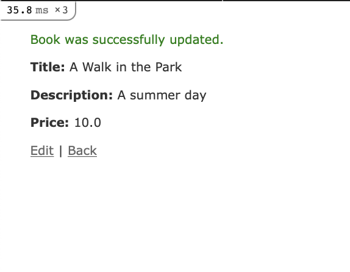
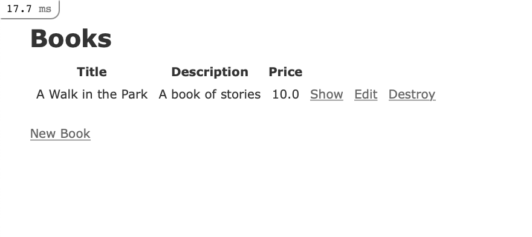
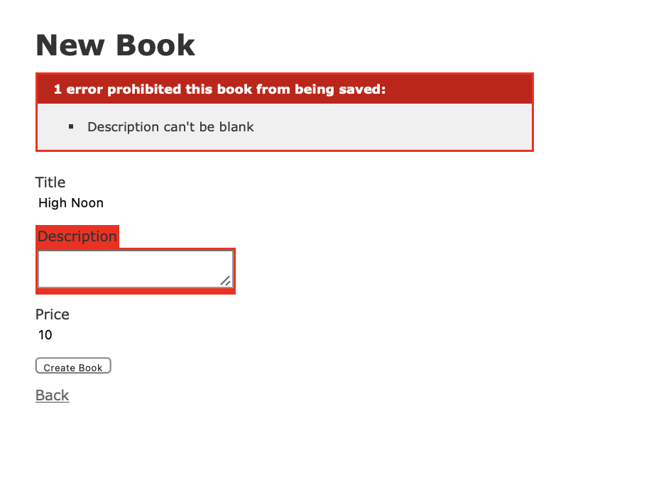
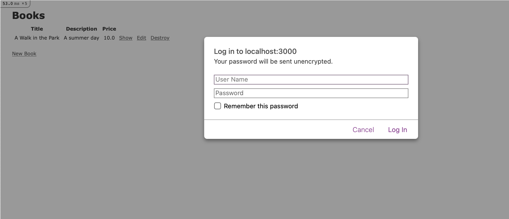

## Step 4 — Creating the Application Root View and Testing Functionality
Ideally, you want the landing page of your application to map to the application's root, so users can immediately get a sense of the application's purpose.

There are a number of ways you could handle this: for example, you could create a `Welcome` controller and an associated `index` view, which would give users a generic landing page that could also link out to different parts of the application. In our case, however, having users land on our books `index` view will be enough of an introduction to the application's purpose for now.

To set this up, you will need to modify the routing settings in `config/routes.rb` to specify the root of the application.
Open the file for editing using VSCode.

The file will look like this:
```
# config/routes.rb
------------------

Rails.application.routes.draw do
  resources :books
  # For details on the DSL available within this file, see https://guides.rubyonrails.org/routing.html
end
```
 Without setting something more specific, the default view at `http://localhost:3000` will be the default Rails welcome page.

In order to map the root view of the application to the view of the books controller, you will need to add the following line to the file:
```
# config/routes.rb
------------------

Rails.application.routes.draw do
  resources :books

  root 'books#index'
  # For details on the DSL available within this file, see https://guides.rubyonrails.org/routing.html
end
```
Now, when users navigate to your application root, they will see a full listing of books, and have the opportunity to create a new book entry, look at existing entries, and edit or delete given entries.

Save the file and exit your editor when you are finished editing. You can do so by pressing `CTRL+X `, `Y`, then `ENTER`.

Start your Rails server once again
```
dip up
```

Your application landing page will look like this:


To create a new book, click on the *New Book* link at the bottom of the page, which will take you to the `book/new` route:


Let's add some demo information to test our application. Input “A Walk in The Park” into the *Title* field, “A book of stories” into the *Description* field, 10 as a *Price*, and we will leave the subject blank for now:

Click on the Create button to create the book.

This will direct you to the `show` route, which, thanks to the `before_action` filter, is set with the `set_book` method, which grabs the id of the book we've just created:
```
# app/controllers/books_controller.rb
-------------------------------------

class BooksController < ApplicationController
  before_action :set_book, only: %i[ show edit update destroy ]

  ...

  # GET /books/1 or /books/1.json
  def show
  end
 
  ...

private
  # Use callbacks to share common setup or constraints between actions.
  def set_book
    @book = Book.find(params[:id])
  end
```


You can test the edit function now by clicking *Edit* on your book entry. This will take you to the edit route for that book:

Change the description for _A Walk in The Park_ to read “A summer day” instead and click *Update Book*. This will take you back to the `show` route:

Finally, clicking *Back* will take you to your updated `index` view:


Now that you have tested your application's basic functionality, you can add some validations and security checks to make everything more secure.

## Step 5 — Adding Validations

Your book application can accept input from users, but imagine a case where a user attempts to create a book without adding a title to it, or creates an entry for a book that's already in the database. You can create mechanisms to check data before it gets entered into the database by adding validations to your models. Since your application's logic is located in its models, validating data input here makes more sense than doing so elsewhere in the application.

Note that we will not cover writing validation tests in this tutorial, but you can find out more about testing by consulting [the Rails documentation](https://guides.rubyonrails.org/testing.html).

If you haven't stopped the server yet, go ahead and do that by typing (in separate terminal)
```
dip down
```
or press `CTRL + C`

Navigate to, and open your `book.rb` model file:

Currently, the file tells us that the `Book` class inherits from `ApplicationRecord`, which in turn inherits from [ActiveRecord::Base](https://api.rubyonrails.org/classes/ActiveRecord/Base.html):
```
# app/models/book.rb
--------------------

class Book < ApplicationRecord
end
```
      
Let's first add some validations to our title field to confirm that the field is filled out and that the entry is unique, preventing duplicate entries:
```
# app/models/book.rb
--------------------

class Book < ApplicationRecord
  validates :title, presence: true, uniqueness: true
end
```
Next, add a validation for the `description` and `price` field to ensure that they, too, are filled out:
```
# app/models/book.rb
--------------------

class Book < ApplicationRecord
  validates :title, presence: true, uniqueness: true
  validates :description, presence: true
  validates :price, presence: true
end
```
We are less concerned here with the uniqueness of the description, as long as they are associated with unique book entries.

Save the file when you are finished.

Start up your server once again
```
dip up
```
Navigate to your application's root at `http://localhost:3000`

Click on *New Book*. In the form, add “A Walk in The Park” to the *Title* field, “Good day” to the *Description* field, and 10 to the *Price* field. Then click on *Create Book*. You should see the following warning:

Now, let's see if we can check our other validation. Click *Back* to return to the homepage, and then *New Book* once again. In the new form, enter “High Noon” in the *Title* field, 10 to the *Price* field, and leave *Description* field blank. Clicking *Create Book* will trigger the following warning:

With these changes, your application has some validations in place to ensure consistency in the data that's saved to the database. Now you can turn your attention to your application's users and defining who can modify application data.

## Step 6 — Adding Authentication
With validations in place, we have some guarantees about the data that's being saved to the database. But what about users? If we don't want any and all users adding to the database, then we should add some authentication measures to ensure that only permitted users can add books. In order to do this, we'll use the [http_basic_authenticate_with](https://api.rubyonrails.org/classes/ActionController/HttpAuthentication/Basic.html) method, which will allow us to create a username and password combination to authenticate users.
 
There are a number of ways to authenticate users with Rails, including working with the [bcrypt](https://rubygems.org/gems/bcrypt/versions/3.1.12) or (our standard) [devise](https://rubygems.org/gems/devise) gems. For now, however, we will add a method to our application controller that will apply to actions across our application. This will be useful if we add more controllers to the application in the future.

Stop your server again with `CTRL+C`.

Open the file that defines your `ApplicationController`, `application_controller.rb`

Inside, you will see the definition for the `ApplicationController` class, which the other controllers in your application inherit from:
```
# app/controllers/application_controller.rb
-------------------------------------------

class ApplicationController < ActionController::Base
end
```
To authenticate users, we'll use a hardcoded username and password with the `http_basic_authenticate_with` method. Add the following code to the file:

```
# app/controllers/application_controller.rb
-------------------------------------------

class ApplicationController < ActionController::Base
  http_basic_authenticate_with name: 'sammy', password: 'wammy', except: [:index, :show]
end
```
In addition to supplying the username and password here, we've also restricted authentication by specifying the routes where it should *not* be required: `index` and `show` . Another way of accomplishing this would have been to write only: `[:create, :update, :destroy]`. This way, all users will be able to look at all of the books and read descriptions of the books. When it comes to modifying site content, however, users will need to prove that they have access.

In a more robust setup, you would not want to hardcode values in this way, but for the purposes of demonstration, this will allow you to see how you can include authentication for your application's routes. It also lets you see how Rails stores session data by default in cookies: once you authenticate on a specified action, you will not be required to authenticate again in the same session.

Save `app/controllers/application_controller.rb` when you are finished editing. You can now test authentication in action.

Start up your server once again
```
dip up
```
On the landing page, click on the *New Book* button. This will trigger the following authentication window:

If you enter the username and password combination you added to `app/controllers/application_controller.rb`, you will be able to securely create a
new book.

You now have a working shark application, complete with data validations and a basic authentication scheme.