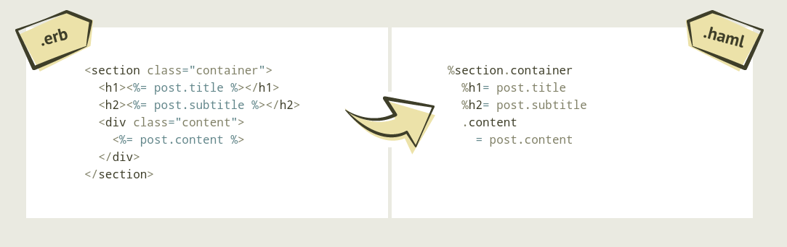

Working with [ERB](https://www.tutorialspoint.com/ruby-on-rails/rails-and-html-erb.htm) can get the job done, but there are fantasic alternatives to achieve the same result with much less code. 

Input [HAML](https://haml.info/). From their website:

> Haml (HTML abstraction markup language) is based on one primary principle: markup should be beautiful. It’s not just beauty for beauty’s sake either; Haml accelerates and simplifies template creation down to veritable haiku.

At BNB, we use HAML's indentation-based markup to manage the nesting our HTML nodes for us. No more managing of closing `</div>` tags everywhere!


## Install haml-rails
First, open your `Gemfile` and add the `haml-rails` gem: 
```
# Gemfile
---------

# Use Active Storage variant
# gem 'image_processing', '~> 1.2'

# Reduces boot times through caching; required in config/boot.rb
gem 'bootsnap', '>= 1.4.4', require: false

gem "haml-rails", "~> 2.0"
```
Then bundle your gemfile with
```
dip bundle i
```
## Convert .erb Views
Haml-rails comes with an amazing command to convert all existing views from `.erb` views into `.haml`. You can do so by running:
```
dip rails haml:erb2haml
```
You will see an output similar to: 
```
Starting bnb-library_postgres_1 ... done
Generating HAML for app/views/books/edit.html.erb...
Generating HAML for app/views/books/new.html.erb...
Generating HAML for app/views/books/index.html.erb...
Generating HAML for app/views/books/show.html.erb...
Generating HAML for app/views/books/_form.html.erb...
Generating HAML for app/views/publishers/edit.html.erb...
Generating HAML for app/views/publishers/new.html.erb...
Generating HAML for app/views/publishers/index.html.erb...
Generating HAML for app/views/publishers/show.html.erb...
Generating HAML for app/views/publishers/_form.html.erb...
Generating HAML for app/views/layouts/mailer.text.erb...
Generating HAML for app/views/layouts/mailer.html.erb...
Generating HAML for app/views/layouts/application.html.erb...
Generating HAML for app/views/reviews/edit.html.erb...
Generating HAML for app/views/reviews/new.html.erb...
Generating HAML for app/views/reviews/index.html.erb...
Generating HAML for app/views/reviews/show.html.erb...
Generating HAML for app/views/reviews/_form.html.erb...
-------------------------------------------------------------
HAML generated for the following files:
        app/views/books/edit.html.erb
        app/views/books/new.html.erb
        app/views/books/index.html.erb
        app/views/books/show.html.erb
        app/views/books/_form.html.erb
        app/views/publishers/edit.html.erb
        app/views/publishers/new.html.erb
        app/views/publishers/index.html.erb
        app/views/publishers/show.html.erb
        app/views/publishers/_form.html.erb
        app/views/layouts/mailer.text.erb
        app/views/layouts/mailer.html.erb
        app/views/layouts/application.html.erb
        app/views/reviews/edit.html.erb
        app/views/reviews/new.html.erb
        app/views/reviews/index.html.erb
        app/views/reviews/show.html.erb
        app/views/reviews/_form.html.erb
-------------------------------------------------------------
Would you like to delete the original .erb files? (This is not recommended unless you are under version control.) (y/n)
```
To which you can respond *'y'*, as we don't want to keep duplicates of the now converted files.

And it will respond with
```
# y

Deleting original .erb files.
-------------------------------------------------------------
Task complete!
No .erb files found. Task will now exit.
```
Great work, you have converted your views!

Let's look at a view to get a feel for what we will be working with. Open `app/views/books/index.html.haml`

```haml
# app/views/books/index.html.haml
---------------------------------

%p#notice= notice
%h1 Books
%table
  %thead
    %tr
      %th Title
      %th Description
      %th Price
      %th{:colspan => "3"}
  %tbody
    - @books.each do |book|
      %tr
        %td= book.title
        %td= book.description
        %td= book.price
        %td= link_to 'Show', book
        %td= link_to 'Edit', edit_book_path(book)
        %td= link_to 'Destroy', book, method: :delete, data: { confirm: 'Are you sure?' }
%br/
= link_to 'New Book', new_book_path
```
See that the file name has changed from `.erb` to `.haml`. We are no longer using closing tags to specify parent and children elements, instead we now use nesting. Be aware, spacing and indentation matters!
