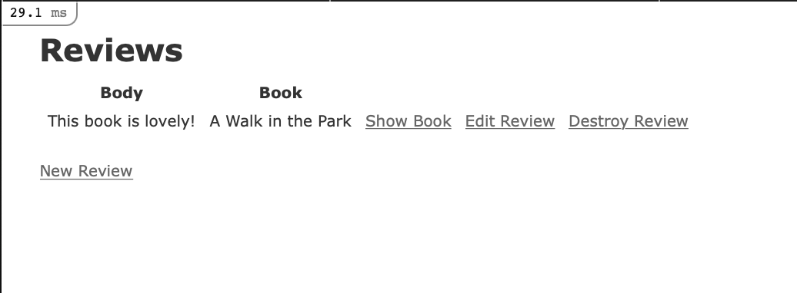
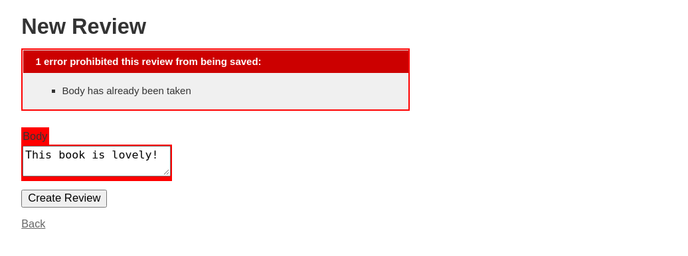
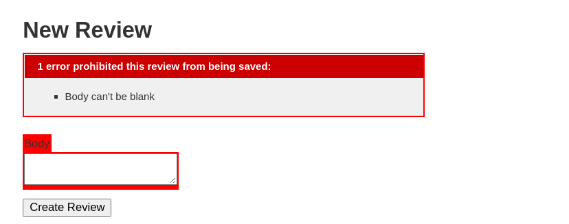

# How To Create Nested Resources for a Ruby on Rails Application

As you add complexity to your Rails applications, you will likely work with multiple models, which represent your application's business logic and interface with your database. Adding related models means establishing meaningful relationships between them, which then affect how information gets relayed through your application's controllers, and how it is captured and presented back to users through views.


In this section, you will build on our existing `bnb-library` Rails application. This application already has a model for handling book data, but you will add a nested resource for reviews about individual books. This will allow users to build out a wider body of thoughts and opinions about individual books.

## Step 1 — Scaffolding the Nested Model

Our application will take advantage of Active Record associations to build out a relationship between `Book` and `Reviews` models: reviews will belong to particular books, and each book can have multiple reviews. Our `Book` and `Review` models will therefore be related through [belongs_to](https://guides.rubyonrails.org/association_basics.html#the-belongs-to-association) and [has_many](https://guides.rubyonrails.org/association_basics.html#the-has-many-association) associations.

The first step to building out the application in this way will be to create a `Reivew` model and related resources. To do this, we can use the `rails generate scaffold` command, which will give us a model, a [database migration](https://guides.rubyonrails.org/active_record_migrations.html) to alter the database schema, a controller, a full set of views to manage standard [Create, Read, Update, and Delete](https://en.wikipedia.org/wiki/) (CRUD) operations, and templates for partials, helpers, and tests. We will need to modify these resources, but using the `scaffold` command will save us some time and energy since it generates a structure we can use as a starting point.

First, make sure that you are in the `bnb-library` directory for the Rails project that you created in the prerequisites:

Create your `Review` resources with the following command:
```ruby
dip rails generate scaffold Reviews body:text book:references
```
With body:text, we're telling Rails to include a `body` field in the `reviews` database table — the table that maps to the `Review` model. We're also including the `:references` keyword, which sets up an association between the `Book` and `Review` models. Specifically, this will ensure that a [foreign key](https://en.wikipedia.org/wiki/Foreign_key) representing each book entry in the `books` database is added to the `reviews` database.

Once you have run the command, you will see output confirming the resources that Rails has generated for the application. Before moving on, you can check your database migration file to look at the relationship that now exists between your models and database tables.
          
You will see the following (the timestamp in the filename will be different):

<figure><strong><code>db/migrate/20210324201444_create_reviews.rb</code></strong></figure>

```ruby
class CreateReviews < ActiveRecord::Migration[6.1]
  def change
    create_table :reviews do |t|
      t.text :body
      t.references :book, null: false, foreign_key: true

      t.timestamps
    end
  end
end
```
As you can see, the table includes a column for a book foreign key. This key will take the form of `model_name_id` — in our case, `book_id`.

Rails has established the relationship between the models elsewhere as well. Take a look at the newly generated `Review` model:

<figure><strong><code>app/models/review.rb</code></strong></figure>

```ruby
class Review < ApplicationRecord
  belongs_to :book
end
```
The `belongs_to` association sets up a relationship between models in which a single instance of the declaring model belongs to a single instance of the named model. In the case of our application, this means that a single review belongs to a single book.

In addition to setting this relationship, the `rails generate scaffold` command also created routes and views for reviews, as it did for our book resources in [Step 3](./scaffolding.md) of Scaffolding.

This is a useful start, but we will need to configure some additional routing and solidify the Active Record association for the `Book` model in order for the relationship between our models and routes to work as desired.

## Step 2 — Specifying Nested Routes and Associations for the Parent Model

Rails has already set the `belongs_to` association in our `Review` model, thanks to the `:references` keyword in the `rails generate scaffold` command, but in order for that relationship to function properly we will need to specify a `has_many` association in our `Book` model as well. We will also need to make changes to the default routing that Rails gave us in order to make reviews resources the children of book resources.

To add the `has_many` association to the `Book` model, open `app/models/book.rb` using VSCode, and add the following line to the file to establish the relationship between books and reviews:

<figure><strong><code>app/models/book.rb</code></strong></figure>

```ruby
class Book < ApplicationRecord
  has_many :reviews
  validates :title, presence: true, uniqueness: true
  validates :description, presence: true
  validates :price, presence: true
end
```
One thing that is worth thinking about here is what happens to reviews once a particular book is deleted. We likely do not want the reviews associated with a deleted book persisting in the database. To ensure that any reviews associated with a given book are eliminated when that book is deleted, we can include the option with the association.

Add the following code to the file to ensure that the action on a given book deletes any associated reviews:


<figure><strong><code>app/models/book.rb</code></strong></figure>

```ruby
class Book < ApplicationRecord
  has_many :reviews, dependent: :destroy
  validates :title, presence: true, uniqueness: true
  validates :description, presence: true
  validates :price, presence: true
end
```
Once you have finished making these changes, save and close the file.

Next, open your `config/routes.rb` file to modify the relationship between your resourceful routes:

Currently, the file looks like this:

<figure><strong><code>config/routes.rb</code></strong></figure>

```ruby
Rails.application.routes.draw do
  resources :reviews
  resources :books
  root "books#index"
  # For details on the DSL available within this file, see https://guides.rubyonrails.org/routing.html
end
```
The current code establishes an independent relationship between our routes, when what we would like to express is a [dependent relationship](https://guides.rubyonrails.org/routing.html#nested-resources) between books and their associated reviews.

Let's update our route declaration to make :books the parent of :reviews. Update the code in the file to look like the following:
```ruby

------------------

Rails.application.routes.draw do
  resources :books do 
    resources :reviews
  end
  root "books#index"
  # For details on the DSL available within this file, see https://guides.rubyonrails.org/routing.html
end
```
Save and close the file when you are finished editing.

With these changes in place, you can move on to updating your reviews controller.

## Step 3 — Updating the Reviews Controller
The association between our models gives us methods that we can use to create new review instances associated with particular books. To use these methods, we will need to add them our review controller.
 
Open the review controller file, and currently, the file looks like this:

<figure><strong><code>app/controllers/reviews_controller.rb</code></strong></figure>

```ruby
class ReviewsController < ApplicationController
  before_action :set_review, only: %i[ show edit update destroy ]

  # GET /reviews or /reviews.json
  def index
    @reviews = Review.all
  end

  # GET /reviews/1 or /reviews/1.json
  def show
  end

  # GET /reviews/new
  def new
    @review = Review.new
  end

  # GET /reviews/1/edit
  def edit
  end

  # POST /reviews or /reviews.json
  def create
    @review = Review.new(review_params)

    respond_to do |format|
      if @review.save
        format.html { redirect_to @review, notice: "Review was successfully created." }
        format.json { render :show, status: :created, location: @review }
      else
        format.html { render :new, status: :unprocessable_entity }
        format.json { render json: @review.errors, status: :unprocessable_entity }
      end
    end
  end

  # PATCH/PUT /reviews/1 or /reviews/1.json
  def update
    respond_to do |format|
      if @review.update(review_params)
        format.html { redirect_to @review, notice: "Review was successfully updated." }
        format.json { render :show, status: :ok, location: @review }
      else
        format.html { render :edit, status: :unprocessable_entity }
        format.json { render json: @review.errors, status: :unprocessable_entity }
      end
    end
  end

  # DELETE /reviews/1 or /reviews/1.json
  def destroy
    @review.destroy
    respond_to do |format|
      format.html { redirect_to reviews_url, notice: "Review was successfully destroyed." }
      format.json { head :no_content }
    end
  end

  private
    # Use callbacks to share common setup or constraints between actions.
    def set_review
      @review = Review.find(params[:id])
    end

    # Only allow a list of trusted parameters through.
    def review_params
      params.require(:review).permit(:body, :book_id)
    end
end
```
 
Like our books controller, this controller's methods work with instances of the associated `Review` class. For example, the `new` method creates a new instance of the `Review` class, the `index` method grabs all instances of the class, and the `set_review` method uses `find` and `params` to select a particular review by `id`. If, however, we want our review instances to be associated with particular book instances, then we will need to modify this code, since the
`Review` class is currently operating as an independent entity.

Our modifications will make use of two things: first, the methods that became available to us when we added the `belongs_to` and `has_many` associations to our models. Specifically, we now have access to the [build method](https://api.rubyonrails.org/classes/ActiveRecord/Associations/ClassMethods.html#method-i-has_many) thanks to the `has_many` association we defined in our `Book` model. This method will allow us to create a collection of review objects associated with a particular book object, using the `book_id` foreign key that exists in our `books` database. And second, the routes and routing helpers that became available when we created a nested `reviews` route. For a full list of example routes that become available when you create nested relationships between resources, see the [Rails documentation](https://guides.rubyonrails.org/routing.html#nested-resources). For now, it will be enough for us to know that for each specific book — say `books/1` — there will be an associated route for reviews related to that book: `books/1/reviews`. There will also be routing helpers like `book_reviews_path(@book)` and `edit_book_reviews_path(@book)` that refer to these nested routes.

In the file, we'll begin by writing a method, `get_book`, that will run before each action in the controller. This method will create a local `@book` instance variable by finding a book instance by `book_id`. With this variable available to us in the file, it will be possible to relate reviews to a specific book in the other methods.

Above the other `private` methods at the bottom of the file, add the following method:

<figure><strong><code>app/controllers/reviews_controller.rb</code></strong></figure>

```ruby
private
  def get_book
    @book = Book.find(params[:book_id])
  end
  # Use callbacks to share common setup or constraints between actions.
```
Next, add the corresponding filter to the *top* of the file, before the existing filter:

<figure><strong><code>app/controllers/reviews_controller.rb</code></strong></figure>

```ruby
class ReviewsController < ApplicationController
  before_action :get_book
```
   
This will ensure that `get_book` runs before each action defined in the file.

Next, you can use this @book instance to rewrite the `index` method. Instead of grabbing all instances of the `Review` class, we want this method to return all review instances associated with a particular book instance.

Modify the index method to look like this:

<figure><strong><code>app/controllers/reviews_controller.rb</code></strong></figure>

```ruby
# GET /reviews or /reviews.json
def index
  @reviews = @book.reviews 
end
```
The `new` method will need a similar revision, since we want a new review instance to be associated with a particular book. To achieve this, we can make use of the `build` method, along with our local @book instance variable.

Change the `new` method to look like this:

<figure><strong><code>app/controllers/reviews_controller.rb</code></strong></figure>

```ruby
# GET /reviews/new
def new
  @review = @book.reviews.build
end
```
This method creates a review object that's associated with the specific book instance from the `get_book` method.

Next, we'll address the method that's most closely tied to `new`: `create`. The `create` method does two things: it builds a new review instance using the parameters that users have entered into the `new` form, and, if there are no errors, it saves that instance and uses a route helper to redirect users to where they can see the new review. In the case of errors, it renders the `new` template again.

Update the `create` method to look like this:

<figure><strong><code>app/controllers/reviews_controller.rb</code></strong></figure>

```ruby
# POST /reviews or /reviews.json
def create
  @review = @book.reviews.build(review_params)

  respond_to do |format|
    if @review.save
      format.html { redirect_to book_reviews_path(@book), notice: "Review was successfully created." }
      format.json { render :show, status: :created, location: @review }
    else
      format.html { render :new, status: :unprocessable_entity }
      format.json { render json: @review.errors, status: :unprocessable_entity }
    end
  end
end
```
Next, take a look at the `update` method. This method uses a `@review` instance variable, which is not explicitly set in the method itself. Where does this variable come from?

Take a look at the filters at the top of the file. The second, auto-generated `before_action` filter provides an answer:
 
The `update` method (like `show`, `edit`, and `destroy`) takes a `@review` variable from the `set_review` method. That method, listed under the `get_book` method with our other private methods, currently looks like this:

<figure><strong><code>app/controllers/reviews_controller.rb</code></strong></figure>

```ruby
private

# Use callbacks to share common setup or constraints between actions.
def set_review
  @review = Review.find(params[:id])
end
```
In keeping with the methods we've used elsewhere in the file, we will need to modify this method so that `@review` refers to a particular instance in the *collection* of reviews that's associated with a particular book. Keep the `build` method in mind here — thanks to the associations between our models, and the methods (like `build`) that are available to us by virtue of those associations, each of our review instances is part of a collection of objects that's associated with a particular book. So it makes sense that when querying for a particular review, we would query the collection of reviews associated with a particular book.

Update `set_review` to look like this:

<figure><strong><code>app/controllers/reviews_controller.rb</code></strong></figure>

```ruby
private

# Use callbacks to share common setup or constraints between actions.
def set_review
  @review = @book.reviews.find(params[:id])
end
```
Instead of finding a particular instance of the entire `Review` class by `id`, we instead search for a matching `id` in the collection of reviews associated with a particular book.

With that method updated, we can look at the `update` and `destroy` methods.

The `update` method makes use of the `@review` instance variable from
`set_review`, and uses it with the `review_params` that the user has entered in the `edit` form. In the case of success, we want Rails to send the user back to the `index` view of the reviews associated with a particular book. In the case of errors, Rails will render the `edit` template again.

In this case, the only change we will need to make is to the `redirect_to` statement, to handle successful updates. Update it to redirect to `book_review_path(@book)`, which will redirect to the `index` view of the selected book's reviews:

<figure><strong><code>app/controllers/reviews_controller.rb</code></strong></figure>

```ruby
# PATCH/PUT /reviews/1 or /reviews/1.json
def update
  respond_to do |format|
    if @review.update(review_params)
      format.html { redirect_to book_review_path(@book), notice: "Review was successfully updated." }
      format.json { render :show, status: :ok, location: @review }
    else
      format.html { render :edit, status: :unprocessable_entity }
      format.json { render json: @review.errors, status: :unprocessable_entity }
    end
  end
end
```
Next, we will make a similar change to the `destroy` method. Update the `redirect_to` method to redirect requests to `book_review_path(@book)` in the
case of success:

<figure><strong><code>app/controllers/reviews_controller.rb</code></strong></figure>

```ruby
# DELETE /reviews/1 or /reviews/1.json
def destroy
  @review.destroy
  respond_to do |format|
    format.html { redirect_to book_reviews_path(@book), notice: "Review was successfully destroyed." }
    format.json { head :no_content }
  end
end
```
This is the last change you will make. You now have a reviews controller that looks like this: 

<figure><strong><code>app/controllers/reviews_controller.rb</code></strong></figure>

```ruby
class ReviewsController < ApplicationController
  before_action :get_book
  before_action :set_review, only: %i[ show edit update destroy ]

  # GET /reviews or /reviews.json
  def index
    @reviews = @book.reviews 
  end

  # GET /reviews/1 or /reviews/1.json
  def show
  end

  # GET /reviews/new
  def new
    @review = @book.reviews.build
  end

  # GET /reviews/1/edit
  def edit
  end

  # POST /reviews or /reviews.json
  def create
    @review = @book.reviews.build(review_params)

    respond_to do |format|
      if @review.save
        format.html { redirect_to book_reviews_path(@book), notice: "Review was successfully created." }
        format.json { render :show, status: :created, location: @review }
      else
        format.html { render :new, status: :unprocessable_entity }
        format.json { render json: @review.errors, status: :unprocessable_entity }
      end
    end
  end

  # PATCH/PUT /reviews/1 or /reviews/1.json
  def update
    respond_to do |format|
      if @review.update(review_params)
        format.html { redirect_to book_reviews_path(@book), notice: "Review was successfully updated." }
        format.json { render :show, status: :ok, location: @review }
      else
        format.html { render :edit, status: :unprocessable_entity }
        format.json { render json: @review.errors, status: :unprocessable_entity }
      end
    end
  end

  # DELETE /reviews/1 or /reviews/1.json
  def destroy
    @review.destroy
    respond_to do |format|
      format.html { redirect_to book_review_path(@book), notice: "Review was successfully destroyed." }
      format.json { head :no_content }
    end
  end

  private
    def get_book
      @book = Book.find(params[:book_id])
    end

    # Use callbacks to share common setup or constraints between actions.
    def set_review
      @review = @book.reviews.find(params[:id])
    end

    # Only allow a list of trusted parameters through.
    def review_params
      params.require(:review).permit(:body, :book_id)
    end
end
```
The controller manages how information is passed from the view templates to the database and vice versa. Our controller now reflects the relationship between our `Book` and `Review` models, in which reviews are associated with particular books. We can move on to modifying the view templates themselves, which are where users will pass in and modify Review information about particular books.

## Step 4 — Modifying Views
Our view template revisions will involve changing the templates that relate to reviews, and also modifying our books `show` view, since we want users to see the reviews associated with particular books.

Let's start with the foundational template for our reviews: the `form` partial that is reused across multiple review templates. Open that form now.
  
Rather than passing only the `review` model to the `form_with` form helper, we will pass both the `book` and `review` models, with `review` set as a child resource.

Change the first line of the file to look like this, reflecting the relationship between our book and review resources:

<figure><strong><code>app/views/reviews/_form.html.erb</code></strong></figure>

```erb
<%= form_with(model: [@book, review]) do |form| %>
```
Next, *delete* the section that lists the `book_id` of the related book, since this is not essential information in the view.

The finished form, complete with our edits to the first line and without the deleted `book_id` section, will look like this:

<figure><strong><code>app/views/reviews/_form.html.erb</code></strong></figure>

```erb
<%= form_with(model: review) do |form| %>
  <% if review.errors.any? %>
    <div id="error_explanation">
      <h2><%= pluralize(review.errors.count, "error") %> prohibited this review from being saved:</h2>

      <ul>
        <% review.errors.each do |error| %>
          <li><%= error.full_message %></li>
        <% end %>
      </ul>
    </div>
  <% end %>

  <div class="field">
    <%= form.label :body %>
    <%= form.text_area :body %>
  </div>

  <div class="actions">
    <%= form.submit %>
  </div>
<% end %>
```
Save and close the file when you are finished editing.
 
Next, open the `index` view, which will show the reviews associated with a particular book.

Thanks to the `rails generate scaffold` command, Rails has generated the better part of the template, complete with a table that shows the `body` field of each review and its associated `book`.

Much like the other code we have already modified, however, this template treats reviews as independent entities, when we would like to make use of the associations between our models and the collections and helper methods that these associations give us.

In the body of the table, make the following updates:

First, update `review.book_id` to `review.book.title`, so that the table will include the title field of the associated book, rather than identifying information about the book object itself:

<figure><strong><code>app/views/reviews/index.html.erb</code></strong></figure>

```erb
<tbody>
  <% @reviews.each do |review| %>
    <tr>
      <td><%= review.body %></td>
      <td><%= review.book.title %></td>
```
Next, change the `Show` redirect to direct users to the `show` view for the associated book, since they will most likely want a way to navigate back to the original book. We can make use of the `@book` instance variable that we set in the controller here, since Rails makes instance variables created in the controller available to all views. We'll also change the text for the link from `Show` to `Show book`, so that users will better understand its function.

Update the this line to the following:

<figure><strong><code>app/views/reviews/index.html.erb</code></strong></figure>

```erb
<tbody>
  <% @reviews.each do |review| %>
    <tr>
      <td><%= review.body %></td>
      <td><%= review.book.title %></td>
      <td><%= link_to 'Show Book', [@book] %></td>
```
In the next line, we want to ensure that users are routed the right nested path when they go to edit a review. This means that rather than being directed to `reviews/review_id/edit`, users will be directed to `book/book_id/reviews/review_id/edit`. To do this, we'll use the `book_review_path` routing helper and our models, which Rails will treat as URLs. We'll also update the link text to make its function clearer.

Update the `Edit` line to look like the following:

<figure><strong><code>app/views/reviews/index.html.erb</code></strong></figure>

```erb
<tbody>
  <% @reviews.each do |review| %>
    <tr>
      <td><%= review.body %></td>
      <td><%= review.book.title %></td>
      <td><%= link_to 'Show Book', [@book] %></td>
      <td><%= link_to 'Edit Review', edit_book_review_path(@book, review) %></td>
```
Next, let's add a similar change to the `Destroy` link, updating its function in the string, and adding our `book` and `review` resources:

<figure><strong><code>app/views/reviews/index.html.erb</code></strong></figure>

```erb
<tbody>
  <% @reviews.each do |review| %>
    <tr>
      <td><%= review.body %></td>
      <td><%= review.book.title %></td>
      <td><%= link_to 'Show Book', [@book] %></td>
      <td><%= link_to 'Edit Review', edit_book_review_path(@book, review) %></td>
      <td><%= link_to 'Destroy Review', [@book, review], method: :delete, data: { confirm: 'Are you sure?' } %></td>
```
Finally, at the bottom of the form, we will want to update the path to take users to the appropriate nested path when they want to create a new review. Update the last line of the file to make use of the `new_book_review_path(@book)` routing helper:

<figure><strong><code>app/views/reviews/index.html.erb</code></strong></figure>

```erb
<%= link_to 'New Review', new_book_review_path(@book) %>
```
The finished file will look like this:

<figure><strong><code>app/views/reviews/index.html.erb</code></strong></figure>

```erb
<p id="notice"><%= notice %></p>

<h1>Reviews</h1>

<table>
  <thead>
    <tr>
      <th>Body</th>
      <th>Book</th>
      <th colspan="3"></th>
    </tr>
  </thead>

  <tbody>
    <% @reviews.each do |review| %>
      <tr>
        <td><%= review.body %></td>
        <td><%= review.book.title %></td>
        <td><%= link_to 'Show Book', [@book] %></td>
        <td><%= link_to 'Edit Review', edit_book_review_path(@book, review) %></td>
        <td><%= link_to 'Destroy Review', [@book, review], method: :delete, data: { confirm: 'Are you sure?' } %></td>
      </tr>
    <% end %>
  </tbody>
</table>

<br>

<%= link_to 'New Review', new_book_review_path(@book) %>
```
Save and close the file when you are finished editing.

The other edits we will make to review views won't be as numerous, since our other views use the `form` partial we have already edited. However, we will want to update the `link_to` references in the other review templates to reflect the changes we have made to our partial.

Open `app/views/reviews/new.html.erb`:

Update the `link_to` reference at the bottom of the file to make use of the `book_reviews_path(@book)` helper:

<figure><strong><code>app/views/reviews/new.html.erb</code></strong></figure>

```erb
<%= link_to 'Back', book_reviews_path(@book) %>
```
Save and close the file when you are finished making this change.

Next, open the `edit` template:

In addition to the `Back` path, we'll update `Show` to reflect our nested resources. Change the last two lines of the file to look like this:

<figure><strong><code>app/views/reviews/edit.html.erb</code></strong></figure>

```erb
<%= link_to 'Show', [@book, @review] %> |
<%= link_to 'Back', book_reviews_path(@book) %>
```
Save and close the file.

Next, open the `show` template:

Make the following edits to the `Edit` and `Back` paths at the bottom of the file:

<figure><strong><code> app/views/reviews/show.html.erb</code></strong></figure>

```erb
<%= link_to 'Edit', edit_book_review_path(@book, @review) %> |
<%= link_to 'Back', book_reviews_path(@book) %>
```
Save and close the file when you are finished.

As a final step, we will want to update the `show` view for our books so that reviews are visible for individual books. Open that file now:

Our edits here will include adding a `Reviews` section to the form and an `Add Review` link at the bottom of the file.

Below the `Price` for a given book, we will add a new section that iterates through each instance in the collection of reviews associated with this book, outputting the `body` of each review.

Add the following code below the `Price` section of the form, and above the redirects at the bottom of the file:

<figure><strong><code>app/views/books/show.html.erb</code></strong></figure>

```erb
<p>
  <strong>Price:</strong>
  <%= @book.price %>
</p>

<h2>Reviews</h2>
<% for review in @book.reviews %>
  <ul>
    <li><%= review.body %></li>
  </ul>
<% end %>
```
Next, add a new redirect to allow users to add a new review for this particular book:

<figure><strong><code>app/views/books/show.html.erb</code></strong></figure>

```erb
<%= link_to 'Edit', edit_book_path(@book) %> |
<%= link_to 'Add Review', book_reviews_path(@book) %> |
<%= link_to 'Back', books_path %>
```  
Save and close the file when you are finished editing.

You have now made changes to your application's models, controllers, and views to ensure that reviews are always associated with a particular book. As a final step, we can add some validations to our `Review` model to guarantee consistency in the data that's saved to the database.

## Step 5 — Adding Validations and Testing the Application
In [Step 5](./functionality.md) of Basic Functionality, you added validations to your `Book` model to ensure uniformity and consistency in the data that gets saved to the `books` database. We'll now take a similar step to ensure guarantees for the `reviews` database as well.

Open the file where your `Review` model is defined:

Here, we want to ensure that reviews are not blank and that they don't duplicate content other users may have posted. To achieve this, add the following line to the file:

<figure><strong><code>app/models/review.rb</code></strong></figure>

```ruby
class Review < ApplicationRecord
  belongs_to :book
  validates :body, presence: true, uniqueness: true
end
```
Save and close the file when you are finished editing.

With this last change in place, you are ready to run your migrations and test the application.

First, run your migrations:
```
dip rails db:migrate
```
Next, start your server.
```
dip up
```
Navigate to your application's root at `http://localhost:3000`.

The prerequisite Rails project tutorial walked you through adding and editing *A Walk in the Park* book entry. If you have not added any further book, the application landing page will look like this:

Click on *Show* next to the *A Walk in the Park* name. This will take you to the `show` view for this book. You will see the title of the book, it's description, and price, and a *Reviews* header with no content. Let's add a review to populate this part of the form.

Click on *Add Review* below the *Review* header. This will bring you to the review `index` view, where you will have the chance to select *New Review*:
   
Thanks to the authentication mechanisms you put in place in [Step 6](./functionality.md) of Basic Functionality, you may be asked to authenticate with the username and password you created in that Step, depending on whether or not you have created a new session.

Click on *New Review*, which will bring you to your review `new` template:
 
In the Body field, type, “This book is lovely!”
 
Click on *Create Review*. You will be redirected to the `index` view for all review that belong to this book:
 
With our review resources working, we can now test our data validations to ensure that only desired data gets saved to the database.

From the index view, click on *New Review*. In the *Body* field of the new form, try entering “This book is lovely!” again:

Click on *Create Review*. You will see the following error:

Click on *Back* to return to the main review page.

To test our other validation, click on *New Review* again. Leave the review blank and click *Create Review*. You will see the following error:

With your nested resources and validations working properly, you now have a working Rails application that you can use as a starting point for further development.

With your Rails application in place, you can now work on things like styling and developing other front-end components!