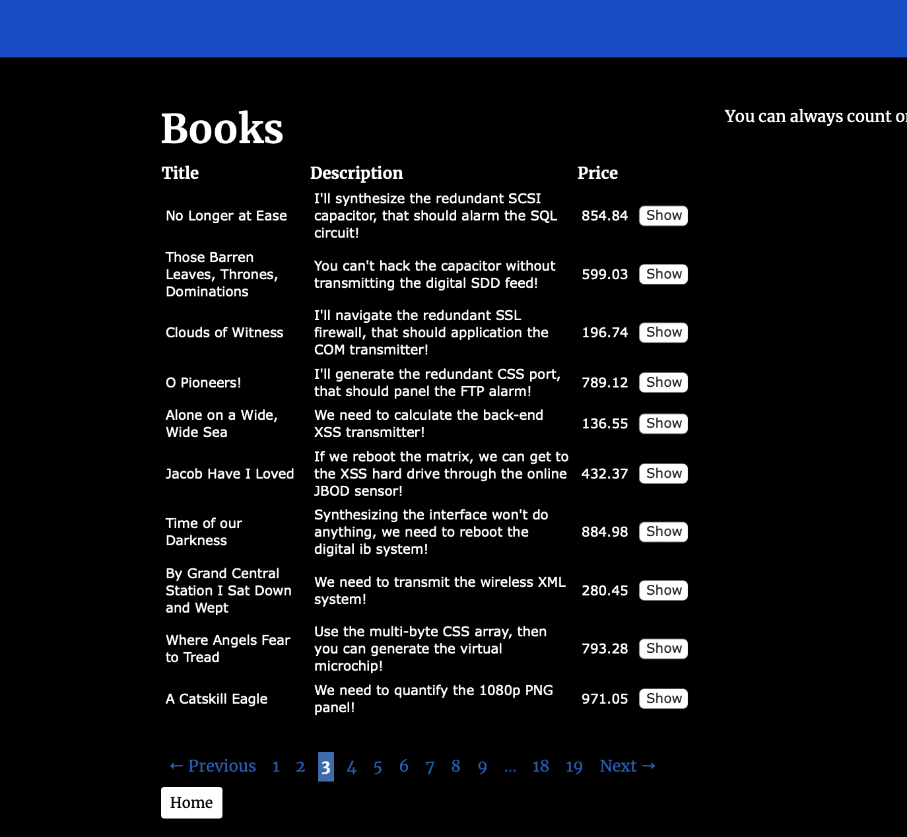

# Adding Pagination

Using the pagination library, [will_paginate](https://github.com/mislav/will_paginate), we will add pagination to our `books` `index` view so we don't create an infinite scrolling scenario.

## Step 1 - Installing will_paginate

To start using [will_paginate](https://github.com/mislav/will_paginate), first add it to your `Gemfile`: 
```rb
# bnb-library/Gemfile
---------------------

gem 'trestle-auth'
gem 'faker', :git => 'https://github.com/faker-ruby/faker.git', :branch => 'master'
gem 'will_paginate'
```
Bundle your Gemfile: 
```
dip bundle install
```

## Step 2 - Pagination and Model / View Integration

[will_paginate](https://github.com/mislav/will_paginate) makes creating a pagination query extremely simple. All we to do is update our `books_controller` `index` view and action. 

Open the file: 
```rb
# app/controllers/books_controller.rb
-------------------------------------

class BooksController < ApplicationController
  before_action :set_book, only: %i[ show edit update destroy ]

  # GET /books or /books.json
  def index
    @books = Book.all
  end

.. .
```
Instead of querying for `Book.all` we are going to instead utilize the `.paginate` method included in the [will_paginate](https://github.com/mislav/will_paginate) gem. It takes a paramter of `:page` that will recieve its value, and let [will_paginate](https://github.com/mislav/will_paginate) know what page to display when you (the user) toggle between different page links.
```rb
# app/controllers/books_controller.rb
-------------------------------------

class BooksController < ApplicationController
  before_action :set_book, only: %i[ show edit update destroy ]

  # GET /books or /books.json
  def index
    @books = Book.paginate(page: params[:page], per_page: 10)
  end

.. .
```
In order to see the pagination links we must update our `index` view.

Open the file: 

```haml
# app/views/books/index.html.haml
---------------------------------

%h1 Books
%table
  %thead
    %tr
      %th Title
      %th Description
      %th Price
      %th{:colspan => "3"}
  %tbody
    - @books.each do |book|
      %tr
        %td= book.title
        %td= book.description
        %td= book.price
        %td= button_to 'Show', book_path(id: book.id), method: :get
%br/
= link_to 'Home', home_index_path, class: 'btn btn-primary btn-sm'
```
Below the `%br` tag, add `will_paginate @books` nested within a div with the class of `paginate` to display the links:
```haml
# app/views/books/index.html.haml
---------------------------------

%h1 Books
%table
  %thead
    %tr
      %th Title
      %th Description
      %th Price
      %th{:colspan => "3"}
  %tbody
    - @books.each do |book|
      %tr
        %td= book.title
        %td= book.description
        %td= book.price
        %td= button_to 'Show', book_path(id: book.id), method: :get
%br/
.paginate
  = will_paginate @books
= link_to 'Home', home_index_path, class: 'btn btn-primary btn-sm'
```
Now open the file `app/javascript/stylesheets/application.scss` and add these customs styles to make our pagination links presentable:
```scss
.pagination {
  color: #0048CD;
  cursor: default;
}
.pagination a, .pagination span, .pagination em {
  padding: 0.2em;
  display: block;
  float: left;
  margin: 5px; 
}
.pagination .disabled {
  color: #999999;
}
.pagination .current {
  font-style: normal;
  font-weight: bold;
  background: #2e6ab1;
  color: $white;
}
.pagination a {
  text-decoration: none;
  color: #105cb6;
}
.pagination a:hover, .pagination a:focus {
  color: $white;
  border-color: #000033; 
}
.pagination .page_info {
  background: #2e6ab1;
  color: $white;
  width: 22em;
  text-align: center; 
}
.pagination .page_info b {
  color: #000033;
  background: #6aa6ed;
  padding: 0.1em 0.25em; 
}
.pagination:after {
  content: ".";
  display: block;
  height: 0;
  clear: both;
  visibility: hidden;
}
* html .pagination {
  height: 1%; }
*:first-child + html .pagination {
  overflow: hidden; 
}
```
You will need to restart your server if it is currently running:
```
dip down
dip up
```
Navigate to `localhost:3000/books` to see our inclusion of [will_paginate](https://github.com/mislav/will_paginate) at work: 


### Great work!