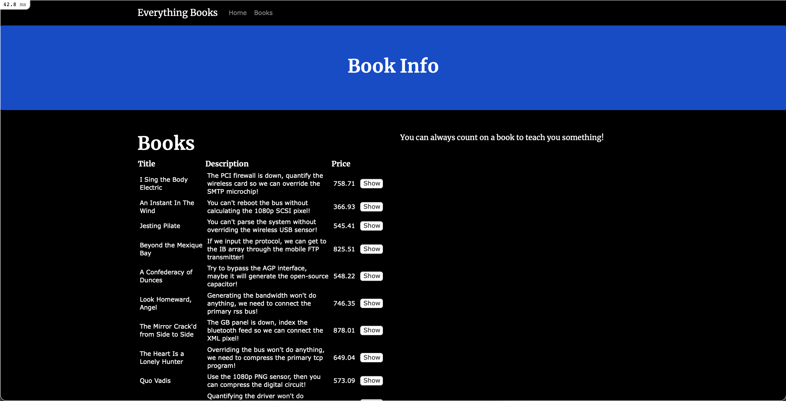

# Seeding the Application

For development and testing purposes a developer may want to work with a large data set. If they were forced to achieve a large dataset by creating each record one-by-one it would waste valuable time and effort. The solution is [seeding the database](https://en.wikipedia.org/wiki/Database_seeding). To make this process even more effecient (_and fun_) we will be utilizing the [Faker](https://github.com/faker-ruby/faker) gem.

## Step 1 - Installing Faker

To start using [Faker](https://github.com/faker-ruby/faker), first add it to your `Gemfile`: 

<figure><strong><code>bnb-library/Gemfile</code></strong></figure>

```rb
gem 'devise'
gem 'trestle-auth'
gem 'faker', :git => 'https://github.com/faker-ruby/faker.git', :branch => 'master'
```
Bundle your Gemfile: 
```
dip bundle install
```

## Step 2 - Building Seeds

Open `db/seeds.rb`. Here we are going to add: 

<figure><strong><code>db/seeds.rb</code></strong></figure>

```rb
require 'faker'

[
  {email: "nathan@brandnewbox.com"},
  {email: "matt@brandnewbox.com"},
  {email: "will@brandnewbox.com"},
  {email: "josh@brandnewbox.com"},
  {email: "isaac@brandnewbox.com"},
  {email: "ashley@brandnewbox.com"},
  {email: "youremail@mail.com"}
].each do |user|
  new_user = User.find_or_initialize_by(email: user[:email])
  if new_user.new_record?
    new_user.password = "password"
    new_user.update!(user)
  end
end

100.times {
  Book.create(
    title: Faker::Book.unique.title,
    price: Faker::Number.decimal(l_digits: 3, r_digits: 2),
    description: Faker::Hacker.say_something_smart
  )
}
```
First, we are requiring the [Faker](https://github.com/faker-ruby/faker) module to have access to its functionality in this file.

Next we added seeds that will create valid `Users` and assign a very secure password of `password` to each `user`. This is common practice in development.

We also added a loop that will run 100 times populating our database with a whole host of books. When the each `:create` method is ran, it will create a new `book` instance with the fields of `:title`, `:price`, and `:description` all containing fake (and humorous) data generated by `Faker`'s api.

Seed the database: 
```
dip rails db:seed
```
If you navigate to `localhost:3000/admin` you will now be able to login and view the `/admin` views using the credentials created above.


Our `index` view of `books` have become congested with a growing list of books:

For a final step, let's add pagination to clean up our views. 