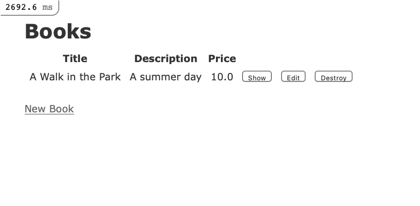
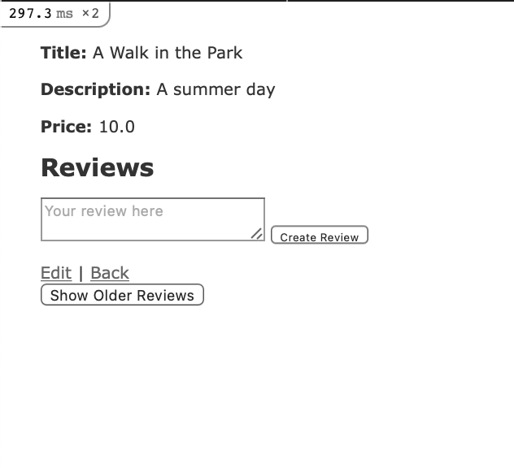
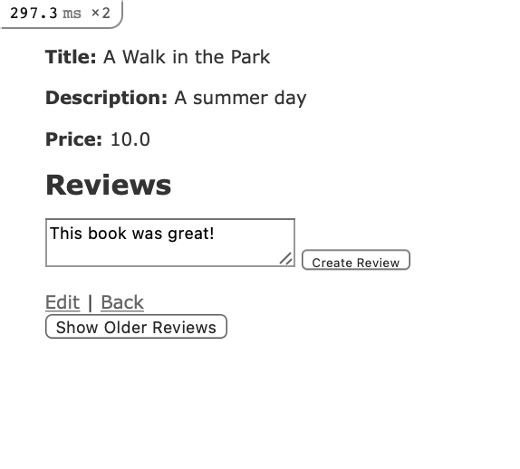
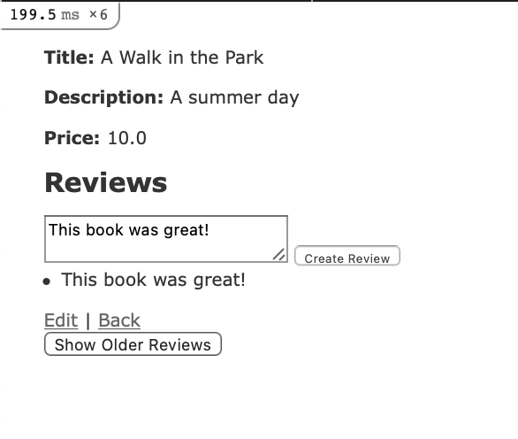
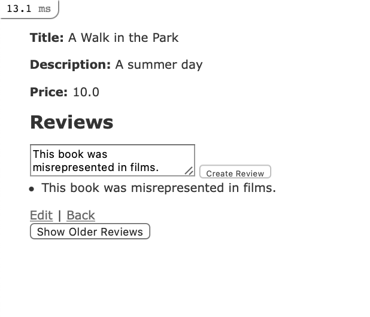
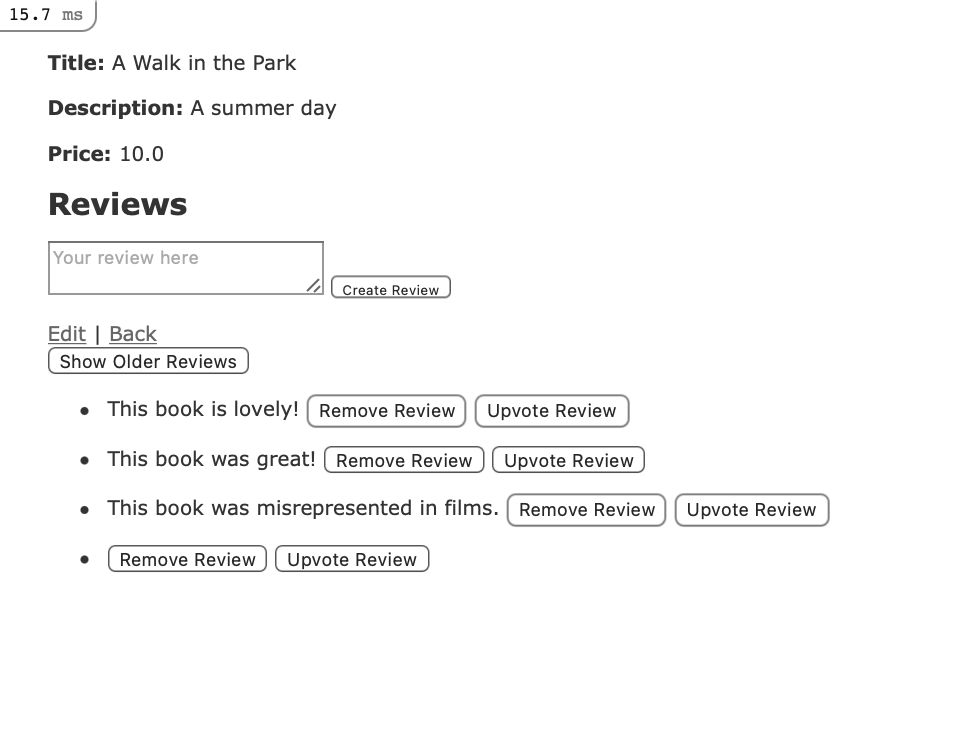
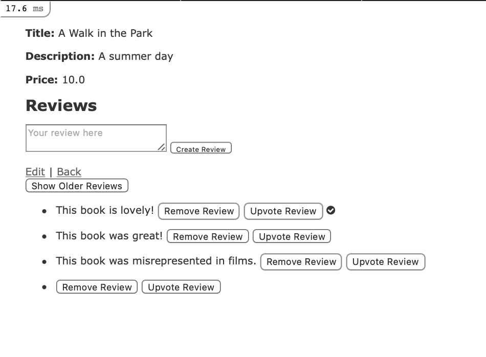
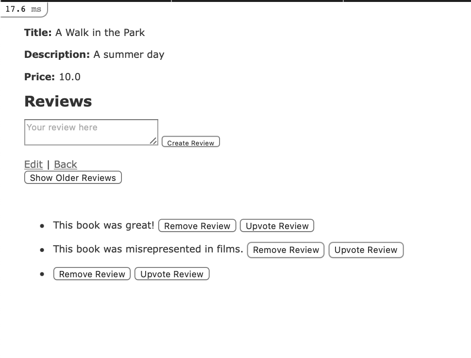

# How To Add Stimulus to a Ruby on Rails Application

If you are working with a Ruby on Rails project, your requirements may include some interactivity with the HTML generated by your [view templates](https://guides.rubyonrails.org/v5.2/action_view_overview.html). If so, you have a few choices for how to implement this interactivity.

For example, you could implement a [JavaScript](https://www.digitalocean.com/community/tags/javascript?type=tutorials) framework like [React](https://reactjs.org/) or [Ember](https://emberjs.com/). If your requirements include handling state on the client side, or if you are concerned about performance issues associated with frequent queries to the server, then choosing one of these frameworks may make sense. Many Single Page Applications (SPAs) take this approach.

However, there are several considerations to keep in mind when implementing a framework that manages state and frequent updates on the client side: 1. It's possible for loading and conversion requirements — things like parsing JavaScript, and fetching and converting JSON to HTML — to limit performance. 2. Commitment to a framework may involve writing more code than your particular use case requires, particularly if you are looking for small-scale JavaScript enhancements. 3. State managed on both the client and server side can lead to a duplication of efforts, and increases the surface area for errors.

As an alternative, the team at [Basecamp](https://basecamp.com/) (the same team that wrote Rails) has created [Stimulus.js](https://stimulusjs.org/), which they describe as “a modest JavaScript framework for the HTML you already have.” Stimulus is meant to enhance a modern Rails application by working with server-side generated HTML. State lives in the [Document Object Model (DOM)](https://www.digitalocean.com/community/tutorial_series/understanding-the-dom-document-object-model), and the framework offers standard ways of interacting with elements and events in the DOM. It works side by side with [Turbolinks](https://github.com/turbolinks/turbolinks) (included in Rails 5+ by default) to improve performance and load times with code that is limited and scoped to a clearly defined purpose.

In this tutorial, you will install and use Stimulus to build on an existing Rails application that offers readers information about books. The application already has a model for handling book data, but you will add a nested resource for review about individual books, allowing users to build out a body of thoughts and opinions about books. This piece runs roughly parallel to [Nested Resources](./nested-resources.md), except that we will be using JavaScript to manipulate the position and appearance of reviews on the page. We will also take a slightly different approach to building out the review model itself.

## Step 1 - Reorganizing Views with Partials

You have created a Review model and controller, so the last thing to think about from a Rails perspective will be the views that present and allow users to input information about books. Views are also the place where you will have a chance to build out interactivity with Stimulus.

In this step, you will map out your views and partials, which will be the starting point for your work with Stimulus.

When we created our Review model, we generated views for our reviews. We will be updating this to handle them through our `books/show` view. 

Remove the `app/views/reviews` folder completely.

Navigate to `app/controllers/reviews_controller.rb` and the contents are currently: 
```rb
# app/controllers/reviews_controller.rb
---------------------------------------

class ReviewsController < ApplicationController
  before_action :get_book
  before_action :set_review, only: %i[ show edit update destroy ]

  # GET /reviews or /reviews.json
  def index
    @reviews = @book.reviews 
  end

  # GET /reviews/1 or /reviews/1.json
  def show
  end

  # GET /reviews/new
  def new
    @review = @book.reviews.build
  end

  # GET /reviews/1/edit
  def edit
  end

  # POST /reviews or /reviews.json
  def create
    @review = @book.reviews.build(review_params)

    respond_to do |format|
      if @review.save
        format.html { redirect_to book_reviews_path(@book), notice: "Review was successfully created." }
        format.json { render :show, status: :created, location: @review }
      else
        format.html { render :new, status: :unprocessable_entity }
        format.json { render json: @review.errors, status: :unprocessable_entity }
      end
    end
  end

  # PATCH/PUT /reviews/1 or /reviews/1.json
  def update
    respond_to do |format|
      if @review.update(review_params)
        format.html { redirect_to book_review_path(@book), notice: "Review was successfully updated." }
        format.json { render :show, status: :ok, location: @review }
      else
        format.html { render :edit, status: :unprocessable_entity }
        format.json { render json: @review.errors, status: :unprocessable_entity }
      end
    end
  end

  # DELETE /reviews/1 or /reviews/1.json
  def destroy
    @review.destroy
    respond_to do |format|
      format.html { redirect_to book_reviews_path(@book), notice: "Review was successfully destroyed." }
      format.json { head :no_content }
    end
  end

  private
    def get_book
      @book = Book.find(params[:book_id])
    end

    # Use callbacks to share common setup or constraints between actions.
    def set_review
      @review = @book.reviews.find(params[:id])
    end

    # Only allow a list of trusted parameters through.
    def review_params
      params.require(:review).permit(:body, :book_id)
    end
end
```
We will update the contents of the file to be:
```rb
# app/controllers/reviews_controller.rb
---------------------------------------

class ReviewsController < ApplicationController
  before_action :get_book

  def create
    @review = @book.reviews.create(review_params)
  end

  def destroy
    @review = @book.reviews.find(params[:id])
    @review.destroy
  end

  private

  def get_book
    @book = Book.find(params[:book_id])
  end

  def review_params
    params.require(:review).permit(:body, :book_id)
  end 
end
```
As you can see we have slimmed down the file and removed much of the logic to handle the responses and redirects with Stimulus.

The `books/show` view that will act as the base for reviews and all partials associated with reviews. So in this view, the first thing we will address is how we will accept user input for new reviews, and how we will present reviews back to the user.

Open the file and it will currently look like this:
```haml
# app/views/books/show.html.haml
--------------------------------

%p#notice= notice
%p
  %strong Title:
  = @book.title
%p
  %strong Description:
  = @book.description
%p
  %strong Price:
  = @book.price
%h2 Reviews
- for review in @book.reviews
  %ul
    %li= review.body
= link_to 'Edit', edit_book_path(@book)
|
= link_to 'Add Review', book_reviews_path(@book)
|
= link_to 'Back', books_path

```
Instead of building all of our functionality into this view, we will use partials — reusable templates that serve a particular function. We will create one partial for new reviews, and another to control how reviews are displayed back to the user. Throughout, we'll be thinking about how and where we can use Stimulus to manipulate the appearance of reviews on the page, since our goal is to control the presentation of reviews with JavaScript.

First, below book price, add an `<h2>` header for reviews and a line to render a partial called `books/reviews`. Second remove the link to *Add Review* and the loop of reviews as we will be handling this display with Javascript:
```haml
# app/views/books/show.html.haml
--------------------------------

%p#notice= notice
%p
  %strong Title:
  = @book.title
%p
  %strong Description:
  = @book.description
%p
  %strong Price:
  = @book.price

%h2 Reviews
= render 'books/reviews'

= link_to 'Edit', edit_book_path(@book)
|
= link_to 'Back', books_path
```
This will render the partial with the form builder for new review objects.

Next, below the `Edit` and `Back` links, we will add a section to control the presentation of older reviews on the page. Add the following lines to the file to render a partial called `books/all`:
```haml
# app/views/books/show.html.haml
--------------------------------

%p#notice= notice
%p
  %strong Title:
  = @book.title
%p
  %strong Description:
  = @book.description
%p
  %strong Price:
  = @book.price

%h2 Reviews
= render 'books/reviews'

= link_to 'Edit', edit_book_path(@book)
|
= link_to 'Back', books_path

%div
  = render 'books/all' 
```
The <div> element will be useful when we start integrating Stimulus into this file.
Once you are finished making these edits, save and close the file. With the changes you've made on the Rails side, you can now move on to installing and integrating Stimulus into your application.


## Step 2 — Installing Stimulus

The first step in using Stimulus will be to install and configure our application to work with it. This will include making sure we have the correct dependencies, including the [Yarn](https://yarnpkg.com/) package manager and [Webpacker](https://github.com/rails/webpacker), the gem that will allow us to work with the JavaScript pre-processor and bundler [webpack](https://webpack.js.org/). With these dependencies in place, we will be able to install Stimulus and use JavaScript to manipulate events and elements in the DOM.

Open your project's Gemfile, which lists the gem dependencies for your project:
```
bnb-library/Gemfile
```
Inside the file, you will see Turbolinks and Webpacker enabled by default:
```rb
# bnb-library/Gemfile
---------------------

# Transpile app-like JavaScript. Read more: https://github.com/rails/webpacker
gem 'webpacker', '~> 5.0'
# Turbolinks makes navigating your web application faster. Read more: https://github.com/turbolinks/turbolinks
gem 'turbolinks', '~> 5'
```
Turbolinks is designed to improve performance by optimizing page loads: instead of having link clicks navigate to a new page, Turbolinks intercepts these click events and makes the page request using [Asynchronous JavaScript and HTML (AJAX)](https://en.wikipedia.org/wiki/Ajax_(programming)). It then replaces the body of the current page and merges the contents of the `<head>` sections, while the JavaScript
`window` and `document` objects and the `<html>` element persist between renders. This addresses one of the main causes of slow page load times: the reloading of CSS and JavaScript resources.

Webpacker has created two new directories in your project's `app` directory, the directory where your main application code is located. The parent directory, `app/javascript`, will be where your project's
JavaScript code will live, and it will have the following structure:
```  
# app/javascript
----------------

├── javascript
│   ├── channels
│   │   ├── consumer.js
│   │   └── index.js
│   └── packs
│       └── application.js
```

The directory will contain two child directories: `app/javascript/packs`
, which will have your webpack entry points, and `app/javascript/channels`,
where you house [Action Cable](https://guides.rubyonrails.org/action_cable_overview.html) channels. When we install Stimulus you will see a auto generated folder of `app/javascript/channels`, this is where you will define your Stimulus [controllers](https://stimulusjs.org/reference/controllers). 

We can now install Stimulus with the following command:
```
dip rails webpacker:install:stimulus
```
You will see output like the following, indicating that the installation was successful:
```
# Output
--------

Starting bnb-library_postgres_1 ... done
Appending Stimulus setup code to /app/app/javascript/packs/application.js
      append  app/javascript/packs/application.js
Creating controllers directory
      create  app/javascript/controllers
      create  app/javascript/controllers/hello_controller.js
      create  app/javascript/controllers/index.js
Installing all Stimulus dependencies
         run  yarn add stimulus from "."
yarn add v1.22.10
[1/4] Resolving packages...
[2/4] Fetching packages...
info fsevents@2.3.2: The platform "linux" is incompatible with this module.
info "fsevents@2.3.2" is an optional dependency and failed compatibility check. Excluding it from installation.
info fsevents@1.2.13: The platform "linux" is incompatible with this module.
info "fsevents@1.2.13" is an optional dependency and failed compatibility check. Excluding it from installation.
[3/4] Linking dependencies...
warning " > webpack-dev-server@3.11.2" has unmet peer dependency "webpack@^4.0.0 || ^5.0.0".
warning "webpack-dev-server > webpack-dev-middleware@3.7.3" has unmet peer dependency "webpack@^4.0.0 || ^5.0.0".
[4/4] Building fresh packages...
success Saved lockfile.
success Saved 5 new dependencies.
info Direct dependencies
└─ stimulus@2.0.0
info All dependencies
├─ @stimulus/core@2.0.0
├─ @stimulus/multimap@2.0.0
├─ @stimulus/mutation-observers@2.0.0
├─ @stimulus/webpack-helpers@2.0.0
└─ stimulus@2.0.0
Done in 13.31s.
Webpacker now supports Stimulus.js 🎉
```
You now have Stimulus installed and ready to use in your application. Next, we'll build out the partials that we referenced in our books `shohw` view — `books/reviews` and `books/all` — using Stimulus controllers, targets, and actions.

## Step 5 — Using Stimulus in Rails Partials
Our `books/reviews` partial will use the [form_with form helper](https://api.rubyonrails.org/v5.2.3/classes/ActionView/Helpers/FormHelper.html) to create a new review object. It will also make use of Stimulus's three core concepts:
controllers, targets, and actions. These concepts work as follows: 
- Controllers are JavaScript classes that are defined in JavaScript modules and exported as the module's default object. Through controllers, you have access to particular HTML elements and the Stimulus Application instance defined in `app/javascript/packs/application.js`. 
- Targets allow you to reference particular HTML elements by name, and are associated with particular controllers. 
- Actions control how DOM events are handled by controllers, and are also associated with particular controllers. They create a connection between the HTML element associated with the controller, the methods defined in the controller, and a DOM event listener.

In our partial, we're first going to build a form as we normally would using Rails. We will then add a Stimulus controller, action, and targets to the form in order to use JavaScript to control how new reviews get added to the page.

First, create a new file for the partial in VSCode:
```haml
app/views/books/_reviews.html.haml
```
Inside the file, add the following code to create a new review object using the form_with helper:
```haml
# app/views/books/_reviews.html.haml
------------------------------------

= form_with model: [@book, @book.reviews.build] do |form|
  = form.text_area :body, placeholder: "Your review here"
  = form.submit
```
So far, this form behaves like a typical Rails form, using the `form_with` helper to build a review object with the fields defined for the `Review` model. Thus, the form has a field for the review `:body`, to which we've added a `placeholder` with a prompt for filling in a review.

Additionally, the form is scoped to take advantage of the collection methods that come with the associations between the `Book` and `Review` models. In this case, the new review object that's created from user-submitted data will belong to the collection of reviews associated with the book we're currently viewing.

Our goal now is to add some Stimulus controllers, events, and actions to control how the review data gets displayed on the page. The user will ultimately submit review data and see it posted to the page thanks to a Stimulus action.

First, we'll add a controller to the form called `reviews` in a `<div>` element:
```haml
# app/views/books/_reviews.html.haml
------------------------------------

%div{data: {controller: "reviews"}}
  = form_with model: [@book, @book.reviews.build] do |form|
    = form.text_area :body, placeholder: "Your review here"
    = form.submit
```  
Make sure you nest the form within the `<div>` tag to scope the controller properly.

Next, we'll attach an action to the form that will be triggered by the form submit event. This action will control how user input is displayed on the page. It will reference an `addBody` method that we will define in the reviews Stimulus controller:
```haml
# app/views/books/_reviews.html.haml
------------------------------------

%div{data: {controller: "reviews"}}
  = form_with model: [@book, @book.reviews.build], data: { action: "reviews#addBody" } do |form|
    = form.text_area :body, placeholder: "Your review here"
    = form.submit
```
We use the `:data` option with `form_with` to submit the Stimulus action as an additional HTML data attribute. The action itself has a value called an
action descriptor made up of the following: *- The DOM event to listen for.* Here, we are using the default event associated with form elements, submit, so we do not need to specify the event in the descriptor itself. For more information about common element/event pairs, see the [Stimulus documentation](https://stimulusjs.org/reference/actions#event-shorthand). - *The controller identifier*, in our case `reviews`. - *The method that the event should invoke.* In our case, this is the `addBody` method that we will define in the controller.

Next, we'll attach a data target to the user input defined in the `:body`
`<textarea>` element, since we will use this inputted value in the addBody method.

Add the following `:data` option to the `<textarea>` element:
```haml
# app/views/books/_reviews.html.haml
------------------------------------

%div{data: {controller: "reviews"}}
  = form_with model: [@book, @book.reviews.build], data: { action: "reviews#addBody" } do |form|
    = form.text_area :body, placeholder: "Your review here", data: { target: "reviews.body" }
    = form.submit
```
Much like action descriptors, Stimulus targets have target descriptors, which include the controller identifier and the target name. In this case, `reviews` is our controller, and `body` is the target itself.
    
As a last step, we'll add a data target for the inputted `body` values so that users will be able to see their reviews as soon as they are submitted.

Add the following `<ul>` element with an add target below the form but within the parent `div`:
```haml
# app/views/books/_reviews.html.haml
------------------------------------

%div{data: {controller: "reviews"}}
  = form_with model: [@book, @book.reviews.build], data: { action: "reviews#addBody" } do |form|
    = form.text_area :body, placeholder: "Your review here", data: { target: "reviews.body" }
    = form.submit
  %ul{data: {target: "reviews.add"}}
```
As with the `body` target, our target descriptor includes both the name of the controller and the target — in this case, `add`.

The finished partial will look like this:
```haml
# app/views/books/_reviews.html.haml
------------------------------------

%div{data: {controller: "reviews"}}
  = form_with model: [@book, @book.reviews.build], data: { action: "reviews#addBody" } do |form|
    = form.text_area :body, placeholder: "Your review here", data: { target: "reviews.body" }
    = form.submit
  %ul{data: {target: "reviews.add"}}
```
Once you have made these changes, you can save and close the file.

You have now created one of the two partials you added to the `books/show` view template. Next, you'll create the second, `books/all`, which will show all of the older reviews from the database.

Create a new file named `_all.html.haml` in the `app/views/books/` directory:
```haml
app/views/books/_all.html.haml
```
Add the following code to the file to iterate through the collection of reviews associated with the selected book:
```haml
app/views/books/_all.html.haml
------------------------------

- @book.reviews.each do |review|
  %ul
    %li.review
      = review.body
```
This code uses a each loop to iterate through each review instance in the collection of review objects associated with a particular book.

We can now add some Stimulus actions to this partial to control the appearance of reviews on the page. Specifically, we will add actions that will control upvotes and whether or not reviews are visible on the page.

Before we do that, however, we will need to add a gem to our project so that we can work with [Font Awesome](https://fontawesome.com/) icons, which we'll use to register upvotes.

Open your Gemfile:
```rb
# bnb-library/Gemfile
```
Below your `haml-rails` gem, add the following line to include the [font-awe some-rails gem](https://github.com/bokmann/font-awesome-rails) in the project:
```rb
# bnb-library/Gemfile
---------------------

gem 'haml-rails', '~> 2.0'
gem 'font-awesome-rails', '~>4.x'
```
Save and close the file. 

Next, install the gem:
```
dip bundle i
```
Finally, open your application's main stylesheet, `app/assets/stylesheets/application.css`:

Add the following line to include Font Awesome's styles in your project:
```css
# app/assets/stylesheets/application.css
----------------------------------------

*
*= require_tree .
*= require_self
*= require font-awesome
*/
```
Save and close the file.

Back in your `app/views/books/_all.html.haml` partial, you can now add two [button_tags](https://api.rubyonrails.org/v5.2.3/classes/ActionView/Helpers/FormTagHelper.html#method-i-button_tag) with associated Stimulus actions, which will be triggered on click events. One button will give users the option to upvote a review and the other will give them the option to remove it from the page view.

Add the following code to `app/views/books/_all.html.haml`:
```haml
# app/views/books/_all.html.haml
--------------------------------

- @book.reviews.each do |review|
  %ul
    %li.review
      = review.body
      = button_tag "Remove Review", data: { controller: "reviews", action: "reviews#remove" }
      = button_tag "Upvote Review", data: { controller: "reviews", action: "reviews#upvote" }
```
Button tags also take a `:data` option, so we've added our reviews Stimulus controller and two actions: `remove` and `upvote`. Once again, in the action
descriptors, we only need to define our controller and method, since the default event associated with button elements is click. Clicking on each of these buttons will trigger the respective `remove` and `upvote` methods defined in our controller.

Save and close the file when you have finished editing.

The final change we will make before moving on to defining our controller is to set a data target and action to control how and when the `books/all` partial will be displayed.

Open the `show` template again, where the initial call to render `books/all` is currently defined:
```
app/views/books/show.html.haml
```
At the bottom of the file, we have a `<div>` element that currently looks like this:
```haml
# app/views/books/show.html.haml
--------------------------------

%p#notice= notice
%p
  %strong Title:
  = @book.title
%p
  %strong Description:
  = @book.description
%p
  %strong Price:
  = @book.price

%h2 Reviews
= render 'books/reviews'

= link_to 'Edit', edit_book_path(@book)
|
= link_to 'Back', books_path

%div
  = render 'books/all' 
```
First, add a controller to this `<div> `element to scope actions and targets:
```haml
# app/views/books/show.html.haml
--------------------------------

%div{data: {controller: 'reviews'}}
  = render 'books/all' 
```
Next, add a button to control the appearance of the partial on the page. This button will trigger a `showAll` method in our reviews controller.
Add the button below the `<div>` element and above the render statement:
```haml
# app/views/books/show.html.haml
--------------------------------

%div{data: {controller: 'reviews'}}
  %button{data: {action: "reviews#showAll"}} Show Older Reviews
  = render 'books/all' 
```
Again, we only need to identify our `reviews` controller and `showAll` method here — the action will be triggered by a click event.

Next, we will add a data target. The goal of setting this target is to control the appearance of the partial on the page. Ultimately, we want users to see older reviews only if they have opted into doing so by clicking on the `Show Older Reviews` button.

We will therefore attach a data target called `show` to the `books/all` partial, and set its default style to [visibility:hidden](https://developer.mozilla.org/en-US/docs/Web/CSS/visibility). This will hide the partial unless users opt in to seeing it by clicking on the button.

Add the following `<div>` element with the `show` target and `style` definition below the button and nest the partial render statement within it:
```haml
# app/views/books/show.html.haml
--------------------------------

%div{data: {controller: 'reviews'}}
  %button{data: {action: "reviews#showAll"}} Show Older Reviews
  %div{data: {target: 'reviews.show'}, style: 'visibility:hidden'}
    = render 'books/all' 
```
The finished `show` template will look like this:
```haml
# app/views/books/show.html.haml
--------------------------------

%p#notice= notice
%p
  %strong Title:
  = @book.title
%p
  %strong Description:
  = @book.description
%p
  %strong Price:
  = @book.price

%h2 Reviews
= render 'books/reviews'

= link_to 'Edit', edit_book_path(@book)
|
= link_to 'Back', books_path

%div{data: {controller: 'reviews'}}
  %button{data: {action: "reviews#showAll"}} Show Older Reviews
  %div{data: {target: 'reviews.show'}, style: 'visibility:hidden'}
    = render 'books/all' 
```
Save and close the file when you are finished editing.

With this template and its associated partials finished, you can move on to creating the controller with the methods you've referenced in these files.

## Step 6 — Creating the Stimulus Controller
Installing Stimulus created the `app/javascript/controllers` directory, which is where webpack is loading our application context from, so we will create our reviews controller in this directory. This controller will include each of the methods we referenced in the previous step: 
- `addBody()`, to add new reviews. 
- `showAll()`, to show older reviews. 
- `remove()`, to remove reviews from the current view. 
- `upvote()`, to attach an upvote icon to reviews.

Create a file called reviews_controller.js in the `app/javascript/controllers` directory:
```rb
# app/javascript/controllers/reviews_controller.js
```
First, at the top of the file, extend Stimulus's built-in `Controller` class:
```js
# app/javascript/controllers/reviews_controller.js
--------------------------------------------------

import { Controller } from "stimulus"

export default class extends Controller {

}
```
Next, add the following target definitions to the file:
```js
# app/javascript/controllers/reviews_controller.js
--------------------------------------------------

import { Controller } from "stimulus"

export default class extends Controller {
  static targets = ["body", "add", "show"]

}
```
Defining targets in this way will allow us to access them in our methods with the `this.target-nameTarget` property, which gives us the first matching target element. So, for example, to match the `body` data target defined in our targets array, we would use `this.bodyTarget`. This property allows us to manipulate things like input values or css styles.

Next, we can define the `addBody` method, which will control the appearance of new reviews on the page. Add the following code below the target definitions to define this method:
```js
# app/javascript/controllers/reviews_controller.js
--------------------------------------------------

import { Controller } from "stimulus"

export default class extends Controller {
  static targets = ["body", "add", "show"]

  addBody() {
    let content = this.bodyTarget.value;
    this.addTarget.insertAdjacentHTML('beforebegin', "<li>" + content + "</li>");
  }
}
```
This method defines a content variable with the [let keyword](https://www.digitalocean.com/community/tutorials/understanding-variables-scope-hoisting-in-javascript#difference-between-var,-let,-and-const) and sets it equal to the review input string that users entered into the reviews form. It does this by virtue of the `body` data target that we attached to the `<textarea>` element in our form. Using `this.bodyTarget` to match this element, we can then use the [value property](https://developer.mozilla.org/en-US/docs/Web/API/HTMLTextAreaElement) that is associated with that element to set the value of `content` as the review input users have entered.

Next, the method adds this review input to the `add` target we added to the `<ul>` element below the form builder in the `books/reviews` partial. It does this using the [Element.insertAdjacentHTML() method](https://developer.mozilla.org/en-US/docs/Web/API/Element/insertAdjacentHTML), which will insert the content of the new review, set in the `content` variable, before the `add` target element. We've also enclosed the new review in an `<li>` element, so that new reviews appear as bulleted list items.

Next, below the `addBody` method, we can add the `showAll` method, which will control the appearance of older reviews on the page:
```js
# app/javascript/controllers/reviews_controller.js
--------------------------------------------------

import { Controller } from "stimulus"

export default class extends Controller {
  static targets = ["body", "add", "show"]

  addBody() {
    let content = this.bodyTarget.value;
    this.addTarget.insertAdjacentHTML('beforebegin', "<li>" + content + "</li>");
  }

  showAll() {
    this.showTarget.style.visibility = "visible";
  }
}
```
Here, we again use the `this.target-nameTarget` property to match our `show` target, which is attached to the `<div>` element with the `books/all` partial. We gave it a default style, `"visibility:hidden"`, so in this method, we simply change the style to `"visible"`. This will show the partial to users who have opted into seeing older reviews.
       
Below `showAll`, we'll next add an `upvote` method, to allow users to “upvote” reviews on the page by attaching the [free](https://fontawesome.com/icons?d=gallery&m=free) Font Awesome `check-circle` icon to a particular review.

Add the following code to define this method:
```js
# app/javascript/controllers/reviews_controller.js
--------------------------------------------------

export default class extends Controller {

  showAll() {
    this.showTarget.style.visibility = "visible";
  }

  upvote() {
    let review = event.target.closest(".review");
    review.insertAdjacentHTML('beforeend', '<i class="fa fa-check-circle"></i>');
  }
}
```
Here, we're creating a `review` variable that will target the closest `<li>` element with the class `review` — the class we attached to each `<li>` element in our loop iteration in `books/all`. This will target the closest review and add the `check-circle` icon just inside `<li>` element, after its last child.

Next, we'll use a similar method to hide reviews on the page. Add the following code below the `upvote` method to define a `remove` method:
```js
# app/javascript/controllers/reviews_controller.js
--------------------------------------------------

export default class extends Controller {
  upvote() {
    let review = event.target.closest(".review");
    review.insertAdjacentHTML('beforeend', '<i class="fa fa-check-circle"></i>');
  }

  remove() {
    let review = event.target.closest(".review");
    review.style.visibility = "hidden";
  }
}
```
Once again, our `review` variable will target the closest `<li>` element with the class `review`. It will then set the visibility property to `"hidden"` to hide the review on the page.

The finished controller file will now look like this:
```js
# app/javascript/controllers/reviews_controller.js
--------------------------------------------------

import { Controller } from "stimulus"

export default class extends Controller {
  static targets = ["body", "add", "show"]

  addBody() {
    let content = this.bodyTarget.value;
    this.addTarget.insertAdjacentHTML('beforebegin', "<li>" + content + "</li>");
  }

  showAll() {
    this.showTarget.style.visibility = "visible";
  }

  upvote() {
    let review = event.target.closest(".review");
    review.insertAdjacentHTML('beforeend', '<i class="fa fa-check-circle"></i>');
  }

  remove() {
    let review = event.target.closest(".review");
    review.style.visibility = "hidden";
  }
}
```
Save and close the file when you are finished editing.

With your Stimulus controller in place, you can move on to making some final changes to the `index` view and testing your application.

## Step 7 — Modifying the Index View and Testing the Application
With one final change to the books `index` view you will be ready to test out your application.

Open the file:
```rb
# app/views/books/index.html.haml
```
In place of the `link_to` helpers that were autogenerated for us to display and destroy books, we'll use `button_to` helpers. This will help us work with generated HTML code instead of the default Rails JavaScript assets.
   
Replace the existing `link_to` helpers in the file with the following `button_to` helpers:
```haml
# app/views/books/index.html.haml
---------------------------------

%tbody
  - @books.each do |book|
    %tr
      %td= book.title
      %td= book.description
      %td= book.price
      %td= button_to 'Show', book_path(id: book.id), method: :get
      %td= button_to 'Edit', edit_book_path(id: book.id), method: :get                    |
      %td= button_to 'Destroy', book_path(id: book.id), method: :delete
```
These helpers accomplish much the same things as their `link_to` counterparts, but the `Destroy` helper now relies on generated HTML rather than Rails's default JavaScript.

Save and close the file when you are finished editing.
  
You are now ready to test your application. 

Next, if you have not stopped your server since adding `font-awesome` you will need to stop then start your server again.
```
dip down
dip up
```
Navigate to the application landing page in your browser, `localhost:3000`.

You will see the following landing page:

Clicking on *Show* will take you to the `show` view for this book. Here you will see a form to fill out a review:

In the review form, type “This book was great!”:

Click on *Create Review*. You will now see the new review on the page:

You can add another new review, if you would like. This time, type “This book was misrepresented in films.” and click *Create Review*:

Test the functionality of the *Show Older Reviews* feature. Clicking on *Show Older Reviews* will now show you the reviews you created:

You can now upvote a review by clicking on the *Upvote Review* button:

Similarly, clicking *Remove Review* will hide the review:

You have now confirmed that you have a working Rails application that uses Stimulus to control how nested review resources are displayed on individual book pages. You can use this as the jumping off point for future development and experimentation with Stimulus.

Stimulus represents a possible alternative to working with [rails-ujs](https://github.com/rails/rails/tree/master/actionview/app/assets/javascripts), [JQuery](https://jquery.com/), and frameworks like React and Vue.

As discussed in the introduction, Stimulus makes the most sense when you need to work directly with HTML generated by the server. It is lightweight, and aims to make code – particularly HTML – self-explanatory to the highest degree possible. If you don't need to manage state on the client side, then Stimulus may be a good choice.
