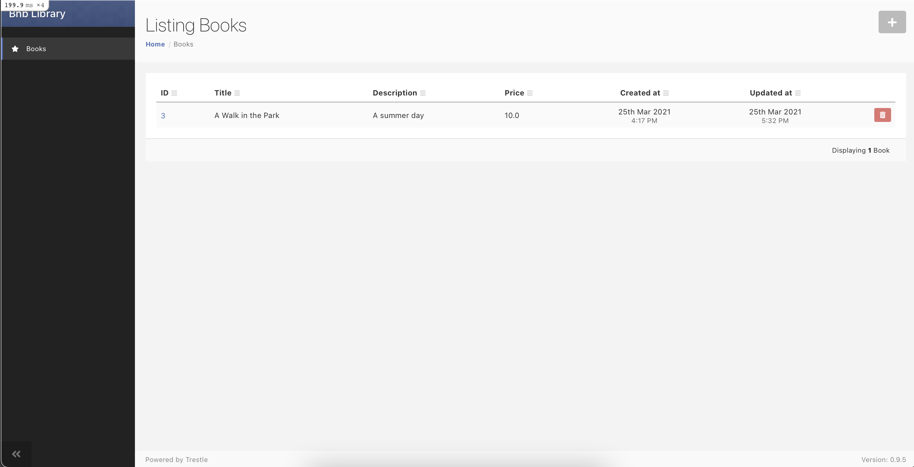
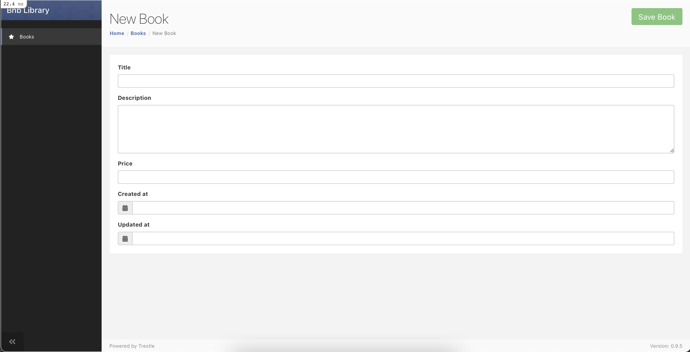
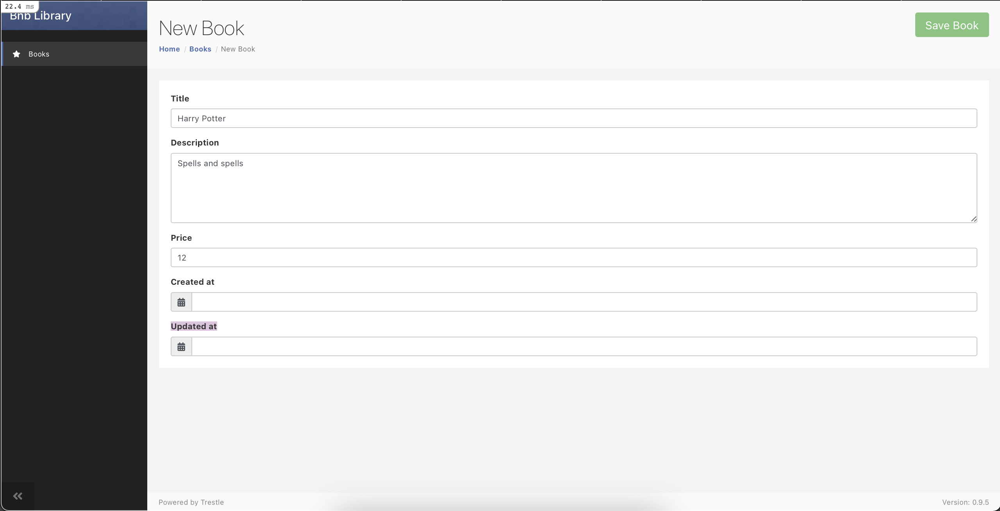
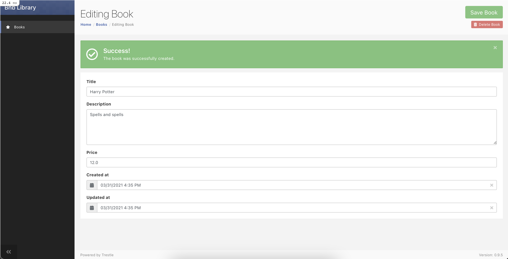
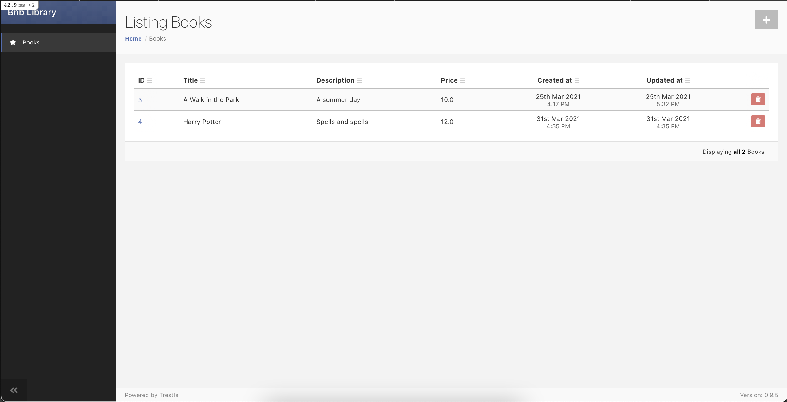

# Adding a Admin Framework

In many of our applications at Brand New Box we include a Admin portal or framework for admin users to manage standard [Create, Read, Update, and Delete](https://en.wikipedia.org/wiki/) (CRUD) operations. Right now anyone can create, update or destroy a book in our app. If you think of a traditional library, only employees could include or exclude a book from the library, so let's create similar permissions.

Remember how cool it was the first time you generated scaffolding using the [rails generate](https://guides.rubyonrails.org/command_line.html#rails-generate) command? [Trestle](https://github.com/TrestleAdmin/trestle) emulates this, but creates even more features. 

## Step 1 - Add the gem
To start using Trestle, first add it to your Gemfile: 

<figure><strong><code>bnb-library/Gemfile</code></strong></figure>

```rb
gem "haml-rails", "~> 2.0"
gem 'font-awesome-rails', '~>4.x'
gem 'trestle'
```
Bundle your Gemfile: 
```
dip bundle install
```
You can expect to see an output similar to: 

<figure><strong><code>output</code></strong></figure>

```rb
Fetching gem metadata from https://rubygems.org/............
Fetching gem metadata from https://rubygems.org/.
Resolving dependencies...
.. .
Using html2haml 2.2.0
Using haml-rails 2.0.1
Using jbuilder 2.11.2
# Fetching kaminari-core 1.2.1
# Installing kaminari-core 1.2.1
# Fetching kaminari-actionview 1.2.1
# Installing kaminari-actionview 1.2.1
# Fetching kaminari-activerecord 1.2.1
# Installing kaminari-activerecord 1.2.1
# Fetching kaminari 1.2.1
# Installing kaminari 1.2.1
Using rb-fsevent 0.10.4
.. .
Using semantic_range 3.0.0
Using spring 2.1.1
# Fetching trestle 0.9.5
# Installing trestle 0.9.5
Using turbolinks-source 5.2.0
Using turbolinks 5.2.1
Using web-console 4.1.0
Using webdrivers 4.6.0
Using webpacker 5.2.1
Bundle complete! 20 Gemfile dependencies, 88 gems now installed.
Use `bundle info [gemname]` to see where a bundled gem is installed.
```

## Step 2 - Generate Resource
Now we will take advantage of the install generator baked into Trestle to create the initial configuration file and customization hooks:
```
dip rails generate trestle:install
```
which will create a `app/admin` directory and some accompanying stylesheets.

<figure><strong><code>output</code></strong></figure>

```rb
Starting bnb-library_postgres_1 ... done
Running via Spring preloader in process 19

    create  config/initializers/trestle.rb
    create  app/assets/stylesheets/trestle/_theme.scss
    create  app/assets/stylesheets/trestle/_custom.scss
    create  app/assets/javascripts/trestle/custom.js
    create  app/admin
```
Now using the resource generator provided by Trestle we can build our first Admin Resource.

Run the command: 
```
dip rails generate trestle:resource Book
```
You will need to restart your server if it is currently running:
```
dip down
dip up
```
Navigate to `localhost:3000/admin` to view the new `book_admin` resource you have generated. 

You will see the following view:

From here you can Create, Read, Update, and Delete all books.

Wow, not a lot of code for a lot of functionality!

To create a new book, you can press the *plus* icon in the top right hand corner. This will redirect you to a `New Book` form from which we will create a new book.

Add the following content to the form:
- `Title`: Harry Potter
- `Description`: Spells and spells
- `Price`: 12
- Leave `Created at` and `Updated at` blank

Then press the *Save Book* button in the top right hand corner.

If you navigate back to `localhost:3000/admin/books` you will see that your book has been created and added to the `index` list of all books.

We now have the desired Admin functionality in place, but we need to head back to non-admin views and remove the ability to Create, Update, or Delete books.

## Step 3 - Update View Actions

Navigate to `app/views/books/index.html.haml` in VSCode. The current contents of the file are: 

<figure><strong><code>app/views/books/index.html.haml</code></strong></figure>

```haml
%p#notice= notice
%h1 Books
%table
  %thead
    %tr
      %th Title
      %th Description
      %th Price
      %th{:colspan => "3"}
  %tbody
    - @books.each do |book|
      %tr
        %td= book.title
        %td= book.description
        %td= book.price
        %td= button_to 'Show', book_path(id: book.id), method: :get
        %td= button_to 'Edit', edit_book_path(id: book.id), method: :get                    |
        %td= button_to 'Destroy', book_path(id: book.id), method: :delete
%br/
= link_to 'New Book', new_book_path, class: 'btn btn-primary btn-sm'
= link_to 'Home', home_index_path, class: 'btn btn-primary btn-sm'
```
We are going to remove the `button_to` helpers for the `edit` and `destroy` actions, as these actions will be reserved for admins only.

<figure><strong><code>app/views/books/index.html.haml</code></strong></figure>

```haml
%p#notice= notice
%h1 Books
%table
  %thead
    %tr
      %th Title
      %th Description
      %th Price
      %th{:colspan => "3"}
  %tbody
    - @books.each do |book|
      %tr
        %td= book.title
        %td= book.description
        %td= book.price
        %td= button_to 'Show', book_path(id: book.id), method: :get
%br/
= link_to 'New Book', new_book_path, class: 'btn btn-primary btn-sm'
= link_to 'Home', home_index_path, class: 'btn btn-primary btn-sm'
```
We are also going to remove the `link_to` helper routing to the `new_book_path`. Again, this action will be reserved for admins only.

<figure><strong><code>app/views/books/index.html.haml</code></strong></figure>

```haml
%p#notice= notice
%h1 Books
%table
  %thead
    %tr
      %th Title
      %th Description
      %th Price
      %th{:colspan => "3"}
  %tbody
    - @books.each do |book|
      %tr
        %td= book.title
        %td= book.description
        %td= book.price
        %td= button_to 'Show', book_path(id: book.id), method: :get
%br/
= link_to 'Home', home_index_path, class: 'btn btn-primary btn-sm'
```
We also need to remove the `edit` book action from `app/views/books/show.html.haml`. Open the file in VSCode.
```rb
app/views/books/show.html.haml
```
The contents of the file are currently: 

<figure><strong><code>app/views/books/show.html.haml</code></strong></figure>

```haml
%p#notice= notice
%p
  %strong Title:
  = @book.title
%p
  %strong Description:
  = @book.description
%p
  %strong Price:
  = @book.price

%h2 Reviews
= render 'books/reviews'

= link_to 'Edit', edit_book_path(@book), class: 'btn btn-primary btn-sm'
= link_to 'Back', books_path, class: 'btn btn-primary btn-sm'

%div{data: {controller: 'reviews'}}
  %button{data: {action: "reviews#showAll"}} Show Older Reviews
  %div{data: {target: 'reviews.show'}, style: 'visibility:hidden'}
    = render 'books/all'
```
Remove the `edit` `link_to` helper:

<figure><strong><code>app/views/books/show.html.haml</code></strong></figure>

```haml
%p#notice= notice
%p
  %strong Title:
  = @book.title
%p
  %strong Description:
  = @book.description
%p
  %strong Price:
  = @book.price

%h2 Reviews
= render 'books/reviews'

= link_to 'Back', books_path, class: 'btn btn-primary btn-sm'

%div{data: {controller: 'reviews'}}
  %button{data: {action: "reviews#showAll"}} Show Older Reviews
  %div{data: {target: 'reviews.show'}, style: 'visibility:hidden'}
    = render 'books/all'
```
Finally, let's update your `config/routes.rb` file:
```rb
config/routes.rb
```
Update the `:books` resources to only include only the `:show`, and `:index` resource so that a user cannot access these routes if they were to know the URL:

<figure><strong><code>config/routes.rb</code></strong></figure>

```rb
.. .
  resources :books, only: [:show, :index] do 
    resources :reviews
  end
.. .
```
We have now configured our application to only allow admins to Create, Update, and Delete books. But there is a major flaw in our current permissions; Anyone can currently access `localhost:3000/admin`, so in the next section we will update our authentication to verify that a user is an admin and is allowed to access the admin actions.